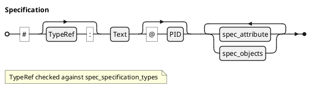
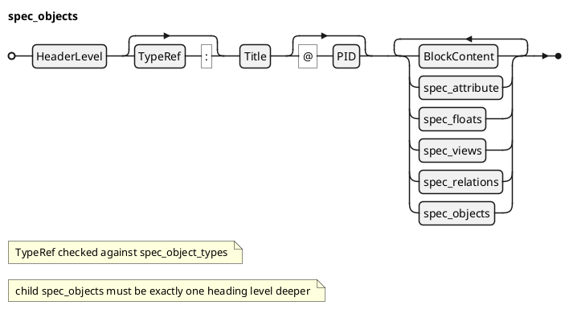
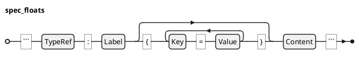
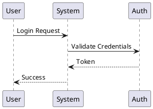
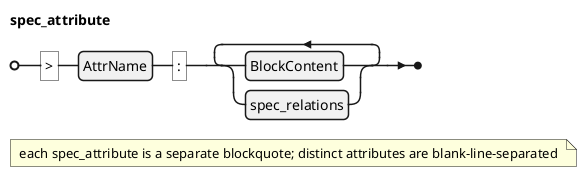
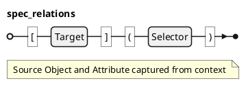
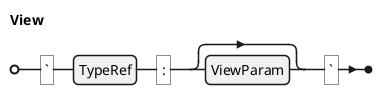

# CommonSpec Language Specification

> version: 1.0

> date: 2026-03-22

## INDEX

`toc:`

## Introduction

### What is CommonSpec?

**CommonSpec** is a structured Markdown language for authoring typed, traceable specifications. It extends standard Markdown (CommonMark) with six constructs that give documents a formal type system: specifications, spec objects, spec floats, attributes, spec relations, and spec views.

CommonSpec documents are plain text files that any Markdown editor can open. The additional constructs use existing Markdown syntax --- headers, blockquotes, fenced code blocks, and inline links --- so no new markup characters are introduced.

### Design Principles

**Markdown superset.** Every valid CommonSpec document is valid Markdown. Editors, diff tools, and version control work unchanged.

**Type-driven.** The type system drives everything: syntax inference, relation resolution, rendering, and verification. Types are declared in models and loaded into the environment before any document is parsed.

**Plain text first.** CommonSpec source is readable without any tooling. The six constructs use familiar Markdown patterns that render meaningfully even in a basic Markdown viewer.

**Model-parameterized.** The language syntax is fixed, but the set of valid types, attributes, and constraints is determined by the active model. The same syntax supports different domains (software requirements, test plans, technical manuals) by loading different models.

### Notation

This specification uses the following notation in formal definitions:

- `$: tau, sigma, alpha, beta, rho, omega` --- Greek letters denote typed values.
- `$: Gamma` --- the model's type environment.
- `$: Gamma . TT_X` --- projection: the set of types of category X within the model (e.g., `$: TT_S` for specification types, `$: TT_O` for object types).
- `$: cc X` --- calligraphic letter denoting a set (e.g., `$: cc A` for a set of attributes).
- `$: sube` --- subset-or-equal relation.
- `$: uu` --- set union.
- `$: bot` --- absence of a value (null / not applicable).
- `$: "infer"(...)` --- a function applied to its arguments.

Grammar productions use Extended BNF (ISO/IEC 14977): `[ ]` for optional, `{ }` for repetition (zero or more), `{ }-` for one or more, `|` for alternation, and `(* *)` for comments.

## Language Constructs

CommonSpec defines six constructs. Each is produced by a specific Markdown syntax pattern.

### Lexical Rules

The following terminals are used throughout the grammar productions:

- **TypeRef** --- an identifier matching a type or alias declared in the model: `[A-Za-z][A-Za-z0-9_-]*`. By convention, canonical type IDs are uppercase (`HLR`, `FIGURE`, `SRS`) while aliases are lowercase (`fig`, `csv`, `plantuml`, `toc`). Resolution is case-insensitive.
- **AttrName** --- an attribute name declared for the enclosing object's type: `[a-z][a-z0-9_]*`. Examples: `status`, `rationale`, `verification_method`.
- **PID** --- a project identifier for cross-referencing. Composed of uppercase letters, digits, hyphens, and dots: `[A-Z][A-Z0-9]*(-[0-9]+)+(\.[0-9]+)*`. Examples: `HLR-001`, `SRS-001`, `LLR-020.1`.
- **Title** / **Text** --- the remaining inline content of a header after the optional `TypeRef ":"` prefix and before the optional `"@" PID` suffix. May contain any valid Markdown inline content.
- **Label** --- a float cross-reference label. Composed of lowercase letters, digits, hyphens, and underscores: `[a-z][a-z0-9_-]*`. Labels must be unique within their float type's counter group.
- **Key** --- a float metadata key. Composed of lowercase letters, digits, hyphens, and underscores: `[a-z][a-z0-9_-]*`.
- **Value** --- a float metadata value. Either a quoted string (`"..."`) or an unquoted token containing no whitespace or `}`.
- **Content** --- the raw body of a fenced code block, from the line after the opening fence to the line before the closing fence.
- **Target** --- the link text of a Markdown link. When the link is a spec relation, Target is interpreted as a PID (for `@` selectors) or a label (for `#` selectors).
- **Selector** --- the URL portion of a Markdown link that triggers spec relation recognition. Must start with `@` or `#`. The full string (including the prefix) is the selector value.
- **ViewParam** --- the parameter portion of a view invocation, following the `TypeRef ":"` prefix. A free-form string whose interpretation is view-type-specific.
- **BlockContent** --- any valid Markdown block-level content (paragraphs, lists, code blocks, blockquotes) that is not recognized as one of the other CommonSpec constructs. See Disambiguation Rules.
- **HeaderLevel** --- a heading marker indicating depth: `"##" | "###" | "####" | "#####" | "######"`.

### Specification

A **Specification** is the root document container, created from an H1 header. It represents a complete document such as an SRS, SDD, or SVC. Each `.md` file produces exactly one specification.

#### Formal Definition

A Specification is a tuple `$: S = (tau, n, "pid", cc A, cc O)` where:

- `$: tau in Gamma . TT_S` is the specification type (e.g. SRS, SDD, SVC, TRR), defined by the model.
- `$: n in "String"` is the document title from the H1 header.
- `$: "pid" in "String"` is the global project identifier, auto-generated from `$: tau` when not explicit.
- `$: cc A sube "SpecAttribute"` is the set of typed attributes (version, status, date, etc.).
- `$: cc O sube "SpecObject"` is the set of child spec objects.

#### Grammar



#### Examples

A specification with an explicit type and PID:

```
# SRS: Login Service @SRS-001

> version: 1.0

> status: Draft
```

A specification with type inferred from title:

```
# User Manual
```

### Spec Object

A **Spec Object** is a traceable element within a specification, created from H2--H6 headers. Objects can be requirements (HLR, LLR), verification cases (VC), design elements (FD, CSC, CSU), or structural sections (SECTION). Each object has a type, an optional PID, and can contain attributes, body content, floats, relations, views, and child objects.

#### Formal Definition

A Spec Object is a tuple `$: O = (tau, "title", "pid", beta, cc A, cc F, cc R, cc V, cc O)` where:

- `$: tau in Gamma . TT_O` is the object type (e.g. HLR, LLR, VC, SECTION).
- `$: "title" in "String"` is the plain-text title from the header.
- `$: "pid" in "String"` is the project identifier for cross-referencing, auto-generated when not explicit.
- `$: beta` is the accumulated body content (block and inline elements).
- `$: cc A sube "SpecAttribute"` is the set of typed attributes.
- `$: cc F sube "SpecFloat"` is the set of child floats.
- `$: cc R sube "SpecRelation"` is the set of child relations in `$: beta`.
- `$: cc V sube "SpecView"` is the set of child views.
- `$: cc O sube "SpecObject"` is the set of child objects (exactly one heading level deeper).

#### Grammar



#### Type Inference

When a header has no explicit `TypeRef:` prefix, the type is inferred:

1. **Implicit type aliases.** The title is matched against the model's implicit type aliases (case-insensitive). For example, a model may map "Introduction" to SECTION.
2. **Default type.** If no alias matches, the model's default object type is used (typically SECTION).

#### PID Auto-Generation

When a header has no explicit `@PID`, a PID is auto-generated using the type's `pid_prefix` and `pid_format` (e.g., `HLR-%03d` produces "HLR-001"), starting from the next available sequence number.

#### Examples

An object with explicit type and PID:

```
## HLR: Authenticate Users @HLR-001

The system shall authenticate users via OAuth 2.0.

> status: Draft

> rationale: Industry standard for web authentication.
```

An object with type inferred from context:

```
## Introduction

This section introduces the system.
```

Nested objects:

```
## HLR: Security @HLR-010

### LLR: Password Policy @LLR-020

Passwords shall be at least 12 characters.
```

### Spec Float

A **Spec Float** is a numbered floating element --- a figure, table, diagram, code listing, or math expression. Floats are created from fenced code blocks with a `TypeRef:Label` info string. They are automatically numbered within their counter group and can be cross-referenced by label.

#### Formal Definition

A Spec Float is a tuple `$: F = (tau, "label", cc "kv", "content")` where:

- `$: tau in Gamma . TT_F` is the float type (e.g. FIGURE, TABLE, PLANTUML, MATH, CODE).
- `$: "label" in "String"` is the cross-reference label, normalized to `{type_prefix}:{user_label}`.
- `$: cc "kv" sube "FloatAttribute"` is the set of untyped metadata (key-value pairs).
- `$: "content"` is the raw payload of the fenced code block.

#### Grammar



#### Float Types and Aliases

The model defines which float types are available. Typical default-model types:

- **FIGURE** (aliases: `fig`) --- image references.
- **TABLE** (aliases: `csv`, `tsv`, `list-table`) --- structured data tables.
- **CODE** (aliases: `listing`, `src`) --- code listings.
- **MATH** (aliases: `math`) --- mathematical expressions.
- **PLANTUML** (aliases: `plantuml`, `puml`) --- UML and other PlantUML diagrams.
- **CHART** (aliases: `chart`) --- data-driven charts.
- **DIAGRAM** (aliases: `diagram`) --- drawing diagrams.

Float types sharing a `counter_group` share a numbering sequence. For example, FIGURE, PLANTUML, CHART, and DIAGRAM may all share counter group FIGURE, producing Figure 1, Figure 2, Figure 3 regardless of specific type.

#### Examples

A CSV table:

````
```csv:sales-data{caption="Quarterly Sales"}
Region,Q1,Q2,Q3
North,100,120,150
South,80,90,110
```
````

A figure:

````
```fig:arch-diagram{caption="System Architecture" source="architecture.png"}
placeholder.png
```
````

A PlantUML diagram:

````

````

### Attribute

An **Attribute** stores metadata for specifications and spec objects using an Entity-Attribute-Value (EAV) pattern. Attributes are declared in blockquotes following headers and support seven datatypes.

#### Formal Definition

A Spec Attribute is a triple `$: A = (tau, beta, cc R)` where:

- `$: tau in Gamma . TT_A` is the attribute type (e.g. "status", "priority", "rationale").
- `$: beta` is the nested blockquote content (block and inline elements).
- `$: cc R sube "SpecRelation"` is the set of child relations extracted from `$: beta`.

#### Grammar



Each `spec_attribute` corresponds to a single Markdown blockquote. Distinct attributes must be separated by a blank line. A multi-line attribute (e.g., XHTML type) uses consecutive `>` lines within the same blockquote.

#### Datatypes

Attributes are typed according to the model's attribute definitions. Seven primitive datatypes are supported:

- **STRING** --- plain text.
- **INTEGER** --- whole numbers. Supports `min_value`/`max_value` bounds.
- **REAL** --- floating-point numbers. Supports `min_value`/`max_value` bounds.
- **BOOLEAN** --- `true` or `false`.
- **DATE** --- ISO 8601 date (`YYYY-MM-DD`).
- **ENUM** --- restricted set of values. Valid values defined in the model.
- **XHTML** --- rich text. Supports full Markdown formatting including links, bold, italic, and lists.

#### Attribute Constraints

Models declare attribute schemas with the following constraints:

- `min_occurs` --- minimum number of values (0 = optional, 1+ = required).
- `max_occurs` --- maximum number of values (1 = single value, >1 = multi-value).
- `min_value`/`max_value` --- bounds for INTEGER and REAL types.

These constraints are enforced by the type system during verification.

#### Multi-Value Attributes

When `max_occurs > 1`, multiple values for the same attribute are written as repeated blockquote lines:

```
> applicable_standard: DO-178C

> applicable_standard: DO-254
```

#### Examples

Simple scalar attributes:

```
> status: Draft

> priority: High

> version: 2.1
```

Rich text (XHTML) attribute:

```
> rationale:
> This component handles **critical** authentication logic.
> See [HLR-001](@) for the parent requirement.
```

Attribute with relation links:

```
> traceability: [HLR-001](@) [HLR-002](@)
```

### Spec Relation

A **Spec Relation** is a traceability link between specification elements. Relations are created from Markdown links where the URL acts as a **selector** that drives type inference. The relation type is not authored explicitly --- it is inferred from the selector, the source context, and the resolved target.

#### Formal Definition

A Spec Relation is a 4-tuple `$: R = (s, t, sigma, alpha)` where:

- `$: s in cc O` is the source object.
- `$: t in (cc O uu cc F)` is the target element (object or float).
- `$: sigma in "String"` is the link selector (the URL portion of the Markdown link).
- `$: alpha in "String" uu {bot}` is the source attribute containing the link, or `$: bot` when the link appears in body text.

The relation type `$: rho in Gamma . TT_R` is **inferred**: `$: rho = "infer"(sigma, alpha, tau_s, tau_t)`.

#### Grammar



#### Link Selectors

Any Markdown link whose URL starts with `@` or `#` is recognized as a spec relation. The full URL string becomes the **selector** --- selectors are not hardcoded but defined by relation types in the model. A base relation type registers a selector value and a resolver; concrete types inherit both via `extends`.

The default model defines these base relation types (and therefore these selectors):

- **`PID_REF`** (selector `@`) --- resolves the link text as a PID against the set of declared PIDs. Example: `[HLR-001](@)`.
- **`LABEL_REF`** (selector `#`) --- resolves the link text as a label against the set of declared object and float labels. Example: `[fig:architecture](#)`.
- **`XREF_CITATION`** (selector `@cite`, `@citep`) --- rewrites to a citation element for bibliography integration. Example: `[smith2024](@cite)`.

Concrete types extend these bases to add semantic constraints without reimplementing resolution. For example, `VERIFIES` extends `PID_REF` --- it inherits the `@` selector and PID resolver, then adds constraints (`source_type_ref = 'VC'`, `source_attribute = 'traceability'`, `target_type_ref = 'HLR,LLR'`) so that a `@` link from a VC's traceability attribute to an HLR is inferred as a VERIFIES relation.

Models can define additional selectors (any string starting with `@` or `#`) by creating new relation types with their own `link_selector` and optional resolver.

#### Type Inference

Relation types are inferred by **constraint matching** with most-specific-wins. Each relation type defines up to 4 optional constraints: `link_selector`, `source_attribute`, `source_type_ref`, `target_type_ref`. A `NULL` constraint is a wildcard --- it matches anything but does not add specificity.

The algorithm:

1. **Filter**: find all relation types whose non-`NULL` constraints are compatible with the current link's values (selector, source attribute, source object type).
2. **Resolve**: call the resolver (determined by the type's `extends` chain) to find the target element.
3. **Score**: for each candidate, count the number of non-`NULL` constraints that matched across all 4 dimensions (adding `target_type` now that the target is known). Candidates whose `target_type_ref` constraint doesn't match are eliminated.
4. **Pick**: the highest-specificity candidate wins. If two candidates tie, the relation is marked ambiguous.

For example, a link `[HLR-001](@)` in a VC object's `traceability` attribute produces these candidates:

| Type | selector | source\_attr | source\_type | target\_type | Score |
| --- | --- | --- | --- | --- | --- |
| VERIFIES | `@` | `traceability` | `VC` | `HLR` | **4** |
| TRACES\_TO | `@` | --- | --- | --- | 1 |
| XREF\_SEC | `@` | --- | --- | ~~`SECTION`~~ | eliminated |

VERIFIES wins with the highest specificity (4 non-NULL constraints matched).

#### Examples

PID references in an attribute:

```
> traceability: [HLR-001](@) [HLR-002](@)
```

Float reference in body text:

```
The architecture is shown in [fig:architecture](#).
```

Cross-document reference:

```
See [SRS-001](@) for the parent specification.
```

### Spec View

A **Spec View** is a dynamic query or generated content block. Views are materialized at processing time and produce content such as tables of contents, lists of figures, abbreviation expansions, and inline math.

#### Formal Definition

A Spec View is a pair `$: V = (tau, omega)` where:

- `$: tau in Gamma . TT_V` is the view type (e.g. TOC, LOF, TRACEABILITY_MATRIX, ABBREV, MATH_INLINE).
- `$: omega in "String"` is the raw parameter string.

#### Grammar



#### View Types

Views are defined by the model. Common view types include:

- **TOC** (`toc:`) --- table of contents.
- **LOF** (`lof:`) --- list of figures.
- **LOT** (`lot:`) --- list of tables.
- **ABBREV** (`abbrev:`) --- abbreviation expansion (e.g., `abbrev: PID` expands to "Project Identifier (PID)").
- **MATH_INLINE** (`math_inline:`) --- inline math expression.
- **TRACEABILITY_MATRIX** --- coverage matrix showing which objects trace to which.
- **REQUIREMENTS_SUMMARY** --- summary report of requirements by type and status.

#### Examples

Inline views:

```
`toc:`
`lof:`
`abbrev: HLR`
`math_inline: x = \frac{-b}{2a}`
```

### Disambiguation Rules

CommonSpec reuses standard Markdown syntax. The following rules determine when a Markdown element is interpreted as a CommonSpec construct versus plain Markdown:

**Blockquote as Attribute vs. plain blockquote.** A blockquote (`> ...`) is recognized as an attribute if and only if:

1. It immediately follows a header (Specification or Spec Object) or another recognized attribute. Each attribute is a separate Markdown blockquote, so distinct attributes must be separated by a blank line.
2. Its first line matches the pattern `AttrName ":" ...`, where AttrName is a declared attribute name for the enclosing object's type.

If either condition fails, the blockquote is treated as plain body content. For example, `> Note: this is important` is a plain blockquote unless the model declares an attribute named "Note" for the enclosing object type.

**Fenced code block as Float vs. plain code block.** A fenced code block is recognized as a spec float if and only if its info string matches the pattern `TypeRef ":" Label`, where TypeRef (or one of its aliases) is a declared float type. A code block with an info string like `` ```python `` (no colon and label) is treated as a plain code block.

**Inline code as View vs. plain inline code.** An inline code span is recognized as a spec view if and only if its content matches the pattern `TypeRef ":"`, where TypeRef is a declared view type. For example, `` `toc:` `` is a view, but `` `x = 5` `` is plain inline code.

**Link as Spec Relation vs. plain link.** A Markdown link `[text](url)` is recognized as a spec relation if and only if the URL starts with `@` or `#` and matches a declared selector. Links with other URL schemes (e.g., `https://`, `./`) are plain Markdown links.

**Heading level gaps.** If a heading skips levels (e.g., H2 followed by H4 with no intervening H3), the document is malformed. Processors should report an error; the missing intermediate level is not implicitly created.

## Type System

CommonSpec is parameterized by a **model** --- a type environment `$: Gamma` that defines what object types, float types, relation types, view types, specification types, datatypes, and attributes exist. The language syntax is fixed; the model determines what types are valid and how they behave.

### Model Structure

A model provides type definitions organized by category:

- **Object types** --- spec object types (e.g., SECTION, HLR, LLR, VC).
- **Float types** --- float types with aliases and counter groups (e.g., FIGURE, TABLE, PLANTUML).
- **Relation types** --- relation types with selectors, resolvers, and constraints (e.g., PID_REF, VERIFIES).
- **View types** --- view types with parameters and materialization logic (e.g., TOC, LOF, ABBREV).
- **Specification types** --- document-level types (e.g., SRS, SDD, SVC).
- **Proof rules** --- constraint violation detectors that enforce model invariants (e.g., missing required attributes, invalid enum values, broken traceability).

### Type Definition Schema

Each type definition declares a schema with the following fields (using object types as an example):

- **id** --- the canonical type identifier (e.g., `HLR`).
- **long_name** --- human-readable name (e.g., "High-Level Requirement").
- **extends** --- parent type for single inheritance (e.g., `TRACEABLE`).
- **pid_prefix** --- prefix for auto-generated PIDs (e.g., `HLR`).
- **pid_format** --- format string for PID numbering (e.g., `%03d`).
- **attributes** --- list of attribute declarations, each with `name`, `type`, and optional constraints.

Relation types additionally declare:

- **link_selector** --- the selector string that triggers this type (e.g., `@`).
- **source_type_ref** / **target_type_ref** --- type constraints for inference.
- **source_attribute** --- attribute context constraint for inference.
- **resolve** --- the resolution strategy (inherited from the base type via `extends`).

### Type Inheritance

Object types support single inheritance via `extends`. A child type inherits all attributes from its parent. For example:

- **SECTION** --- base structural container, no special attributes.
- **TRACEABLE** extends SECTION --- adds `status` attribute (ENUM: Draft, Review, Approved, Implemented).
- **HLR** extends TRACEABLE --- adds `rationale`, `priority`.
- **LLR** extends TRACEABLE --- adds `rationale`, `verification_method`, `traceability`.

### Default Model

The default model provides basic types for general technical publishing:

- **Objects:** SECTION (default, composite), COVER, EXEC_SUMMARY, REFERENCES.
- **Floats:** FIGURE, TABLE, CODE, MATH, PLANTUML, CHART, DIAGRAM.
- **Views:** TOC, LOF, LOT, ABBREV, MATH_INLINE.
- **Specifications:** A single default specification type.

### Domain Models

Domain-specific models extend the default with specialized types. For example, a software documentation model may add:

- **Objects:** HLR, LLR, VC, NFR, FD, DD, CSC, CSU, TR --- for software requirements, design, and verification.
- **Relations:** VERIFIES, TRACES_TO, REALIZES, BELONGS --- for traceability between requirements, design, and tests.
- **Specifications:** SRS, SDD, SVC, TRR, SUM --- for software documentation lifecycle.
- **Views:** TRACEABILITY_MATRIX, REQUIREMENTS_SUMMARY, COVERAGE_SUMMARY --- for analysis and reporting.
- **Proofs:** Missing traceability coverage, invalid attribute values, duplicate PIDs.

## Datatypes

### Primitive Datatypes

CommonSpec defines seven primitive datatypes used for attribute values:

```list-table:primitive-datatypes{caption="Primitive Datatypes" header-rows=1}
Datatype,Syntax,Description
STRING,Plain text,Unformatted text value
INTEGER,Whole number,Numeric value (supports min/max bounds)
REAL,Decimal number,Floating-point value (supports min/max bounds)
BOOLEAN,true / false,Boolean flag
DATE,YYYY-MM-DD,ISO 8601 date
ENUM,Named value,One of a model-declared set of values
XHTML,Markdown text,Rich text preserving block and inline formatting
```

### Enum Definitions

ENUM datatypes declare a fixed set of allowed values. Each value has a `key` (used in CommonSpec source) and a `sequence` (display order). For example, a status attribute might declare:

```
values: Draft, Review, Approved, Implemented
```

In CommonSpec source, the author writes:

```
> status: Draft
```

An enum value that does not match one of the declared keys is a constraint violation.

### Attribute Type Declarations

Models declare which attributes each object type can have, including:

- **name** --- the attribute key as written in CommonSpec (e.g., "status", "rationale").
- **type** --- one of the seven primitive datatypes.
- **min_occurs** --- 0 for optional, 1+ for required.
- **max_occurs** --- 1 for single-value, >1 for multi-value.
- **min_value / max_value** --- bounds for INTEGER and REAL attributes.

## Summary

CommonSpec is a six-construct extension of Markdown:

1. **Specification** (`#` header) --- root document container.
2. **Spec Object** (`##`--`######` headers) --- traceable elements.
3. **Spec Float** (fenced code blocks with `type:label`) --- numbered floats.
4. **Attribute** (blockquotes with `> key: value`) --- typed metadata.
5. **Spec Relation** (links with `[target](@)` or `[target](#)`) --- traceability links.
6. **Spec View** (inline code with `` `type:param` ``) --- dynamic content.

The language is model-parameterized: the type environment determines what types, attributes, relations, and constraints are active. Any compliant processor that loads the same model will interpret the same CommonSpec document identically.
