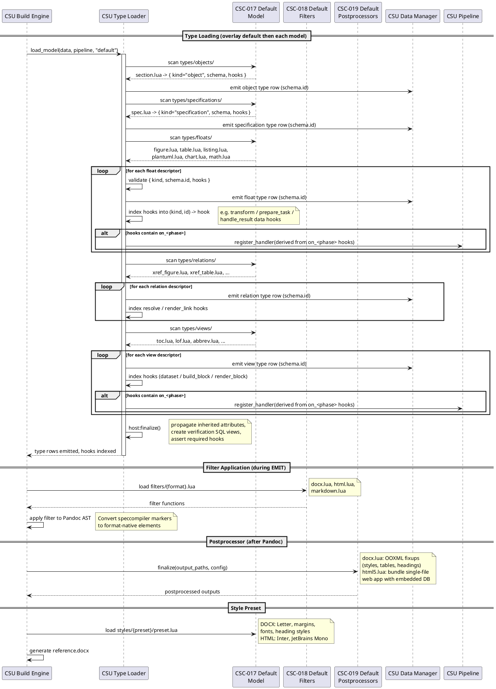

## Model Design

### FD: Type System and Domain Model Definition @FD-005

> traceability: [SF-003](@), [CSC-018](@), [CSC-019](@), [CSC-021](@), [CSC-022](@), [CSC-023](@), [CSC-024](@)

The type system and domain model definition function encompasses the default model
components that provide base type definitions, format-specific processing, and style
configuration. These components are overlaid by the host engine ([dic:type-loader](#), [CSU-008](@)) during the
model discovery phase described in [FD-002](@) and collectively define the foundational
capabilities that all domain models inherit and extend.

**Model Directory Structure**: Each model provides a standard directory layout with
`types/` (objects, floats, relations, views, specifications), `filters/`, `postprocessors/`,
and `styles/` subdirectories. Each `.lua` file under `types/` returns ONE descriptor table
`{ kind, schema, [hooks] }`; the host reads only that table and never sniffs
which "magic key" exists. The default model (`models/default/`) establishes baseline
definitions for all five type categories.

**Type Definitions**: [CSC-017](@) defines the foundational document object and specification types
(`SECTION`, `SPEC`) that every overlay reuses. [CSC-022](@) defines float types (FIGURE, TABLE, LISTING, PLANTUML,
CHART, MATH) with counter groups for shared numbering. [CSC-023](@) defines the reusable base
relation types (`PID_REF`, `LABEL_REF`) plus built-in cross-reference relations
(`XREF_SEC`, `XREF_FIGURE`, `XREF_TABLE`, `XREF_LISTING`, `XREF_MATH`, `XREF_CITATION`) that
map `@` and `#` selectors to typed targets without reimplementing resolution. [CSC-024](@) defines view types (TOC, LOF,
ABBREV, ABBREV_LIST, GAUSS, MATH_INLINE) with inline prefix syntax and materializer
strategies.

**Format Processing**: [CSC-018](@) provides Pandoc Lua filters for DOCX, HTML, and Markdown
output that convert speccompiler-format markers (page breaks, bookmarks, captions, equations)
into native output elements. [CSC-019](@) applies format-specific post-processing after Pandoc
output generation, loading template-specific fixup modules for DOCX and LaTeX. [CSC-021](@)
defines style presets with page layout, typography, and formatting configuration for DOCX
(Letter-sized, standard margins) and HTML (Inter/JetBrains Mono fonts, color palette) output.

**Component Interaction**

The default model is realized through six packages that define the baseline type system,
format processing, and style configuration inherited by all domain models.

[csc:default-float-types](#) (Default Float Types) defines the visual content types. [csu:figure-float-type](#) (FIGURE)
handles image-based floats. [csu:table-float-type](#) (TABLE) handles tabular data with CSV parsing.
[csu:listing-float-type](#) (LISTING) handles code blocks with syntax highlighting. [csu:plantuml-float-type](#) (PLANTUML)
renders UML diagrams via external subprocess. [csu:chart-float-type](#) (CHART) renders ECharts
visualizations. [csu:math-float-type](#) (MATH) renders LaTeX equations via KaTeX. Each type declares a
counter group for cross-specification numbering.

[csc:default-relation-types](#) (Default Relation Types) defines reusable cross-reference relations. The base
types `PID_REF` and `LABEL_REF` centralize `@` and `#` resolution. `XREF_SEC`
targets sections by PID.
[csu:xreffigure-relation-type](#) (XREF_FIGURE) targets FIGURE floats. [csu:xreftable-relation-type](#)
(XREF_TABLE) targets TABLE floats. [csu:xreflisting-relation-type](#) (XREF_LISTING) targets LISTING floats.
[csu:xrefmath-relation-type](#) (XREF_MATH) targets MATH floats. [csu:xrefcitation-relation-type](#) (XREF_CITATION) resolves
bibliography citations via BibTeX keys.

[csc:default-view-types](#) (Default View Types) defines data views with inline prefix syntax. [csu:toc-view-type](#)
(TOC) generates tables of contents from spec objects. [csu:lof-view-type](#) (LOF) generates lists of
figures, tables, or listings by counter group. [csu:abbrev-view-type](#) (ABBREV) renders inline
abbreviation expansions. [csu:abbrevlist-view-type](#) (ABBREV_LIST) generates abbreviation glossaries.
[csu:gauss-view-type](#) (GAUSS) renders Gaussian distribution charts. [csu:mathinline-view-type](#) (MATH_INLINE)
renders inline LaTeX math expressions.

[csc:default-filters](#) (Default Filters) provides format-specific Pandoc Lua filters applied during
EMIT. [csu:docx-filter](#) (DOCX Filter) converts markers to OOXML-compatible elements — page breaks,
bookmarks, and custom styles. [csu:html-filter](#) (HTML Filter) converts markers to semantic HTML5
elements with CSS classes. [csu:markdown-filter](#) (Markdown Filter) normalizes markers for clean
Markdown output.

[csc:default-postprocessors](#) (Default Postprocessors) applies fixups after Pandoc generation. [csu:docx-postprocessor](#)
(DOCX Postprocessor) manipulates the OOXML package — injecting custom styles, fixing table
widths, and applying numbering overrides. [csu:latex-postprocessor](#) (LaTeX Postprocessor) applies
template-specific LaTeX fixups for PDF output.

[csc:default-styles](#) (Default Styles) provides output styling presets. [csu:docx-style-preset](#) (DOCX Style
Preset) defines page layout (Letter, standard margins), heading styles, table formatting, and
font selections for Word output. [csu:html-style-preset](#) (HTML Style Preset) defines the web typography
(Inter/JetBrains Mono), color palette, and responsive layout for HTML output.

#### LLR: Specification Identifier from Filename @LLR-055

Given a source file path, [csu:specification-parser](#) shall derive the [dic:specification](#) `identifier` from the filename without extension.

> verification_method: Test

> traceability: [HLR-TYPE-001](@)

#### LLR: Unknown Specification Type Fallback @LLR-056

When a L1 header declares an unknown `type_ref`, [csu:specification-parser](#) shall fall back to the default [dic:type](#) or emit a [dic:diagnostic-record](#) warning via [csu:diagnostics-collector](#).

> verification_method: Test

> traceability: [HLR-TYPE-001](@)

#### LLR: Spec Object Content-Addressable ID @LLR-057

Given source path, start_line, and title_text, [csu:object-parser](#) and [csu:hash-utilities](#) shall compute the [dic:spec-object](#) `identifier` as SHA1 hash of the concatenation.

> verification_method: Test

> traceability: [HLR-TYPE-002](@)

#### LLR: Spec Object Type Resolution Order @LLR-058

Given L2-H6 header text, [csu:object-parser](#) shall resolve the [dic:type](#) in order: explicit `TYPE:` prefix → [dic:type-alias](#) lookup in [dic:type-registry](#) → default type.

> verification_method: Test

> traceability: [HLR-TYPE-002](@)

#### LLR: Spec Object Label Format @LLR-059

Given a resolved [dic:spec-object](#), [csu:object-parser](#) shall format the `label` field as `{type_lower}:{title_slug}` for `(#)` cross-referencing.

> verification_method: Test

> traceability: [HLR-TYPE-002](@)

#### LLR: Float Short Identifier Format @LLR-060

Given a float source context, [csu:float-parser](#) and [csu:hash-utilities](#) shall compute the [dic:spec-float](#) `identifier` in short format `float-{8-char-sha1}` for DOCX bookmark compatibility.

> verification_method: Test

> traceability: [HLR-TYPE-003](@)

#### LLR: Float Type Alias Resolution @LLR-061

Given a CodeBlock class string, [csu:float-parser](#) shall resolve the [dic:spec-float](#) `type_ref` from [dic:type-alias](#) entries in `spec_float_types` (e.g., "csv" → "TABLE").

> verification_method: Test

> traceability: [HLR-TYPE-003](@)

#### LLR: External Render Delegation @LLR-062

When a [dic:spec-view](#) has `needs_external_render = 1` in `spec_view_types`, [csu:external-render-handler](#) shall delegate it to the registered [dic:external-renderer](#).

> verification_method: Test

> traceability: [HLR-TYPE-004](@)

#### LLR: Inline View Syntax @LLR-063

Given Inline Code with `type: content` format, [csu:view-parser](#) shall insert a [dic:spec-view](#) record with `view_type_ref` and `raw_ast`.

> verification_method: Test

> traceability: [HLR-TYPE-004](@)

#### LLR: PID and Label Selector Resolution @LLR-064

Given a `(@)` [dic:relation-selector](#), [csu:resolution-queries](#) shall resolve via `spec_objects.pid`; given `(#)` [dic:relation-selector](#), [csu:resolution-queries](#) shall resolve via `spec_objects.label` or `spec_floats.label`.

> verification_method: Test

> traceability: [HLR-TYPE-005](@)

#### LLR: Default Relation Type Selection @LLR-065

When no explicit relation type is provided, [csu:relation-type-inferrer](#) shall select the default [dic:spec-relation](#) type where `is_default = 1` AND `link_selector` matches in `spec_relation_types`.

> verification_method: Test

> traceability: [HLR-TYPE-005](@)

#### LLR: ENUM Attribute Resolution @LLR-066

Given an ENUM [dic:attribute](#) raw_value, [csu:attribute-caster](#) shall resolve it against the `enum_values` table and populate the `enum_ref` foreign key.

> verification_method: Test

> traceability: [HLR-TYPE-006](@)

#### LLR: XHTML AST Preservation @LLR-067

Given an XHTML [dic:attribute](#) raw_value, [csu:attribute-parser](#) shall preserve the Pandoc [dic:abstract-syntax-tree](#) serialization in the `ast` column as JSON.

> verification_method: Test

> traceability: [HLR-TYPE-006](@)

#### LLR: Analyze Query Registration @LLR-068

Given a [dic:analyze-query](#) SQL string, [csu:analyze-query-loader](#) shall register it as a `CREATE VIEW` in the [dic:specir](#) database during the [dic:analyze-phase](#) phase.

> verification_method: Test

> traceability: [HLR-TYPE-007](@)

#### LLR: Validation Policy Severity Resolution @LLR-069

Given a [dic:validation-policy](#) `policy_key` and project.yaml configuration, [csu:validation-policy](#) shall return severity (`error`, `warn`, `ignore`) controlling [dic:diagnostic-record](#) emission.

> verification_method: Test

> traceability: [HLR-TYPE-007](@)

---

### DD: Layered Model Extension with Override Semantics @DD-MODEL-001

Selected layered model loading where domain models extend and override the default model by type identifier.

> rationale: ID-based override enables clean domain specialization:
>
> - Default model loads first, establishing baseline types (SECTION, SPEC, float types, relations, views)
> - Domain model loads second; types with matching IDs replace defaults, new IDs add to the registry
> - Verification views follow the same pattern: domain analyze queries override defaults by `policy_key`
> - Attribute inheritance propagated iteratively after all types are loaded, enabling parent attributes to flow to child types across model boundaries
> - Filter, postprocessor, and style directories follow conventional naming for predictable discovery
> - Alternative of mixin composition rejected: ordering ambiguity when multiple mixins define the same attribute
