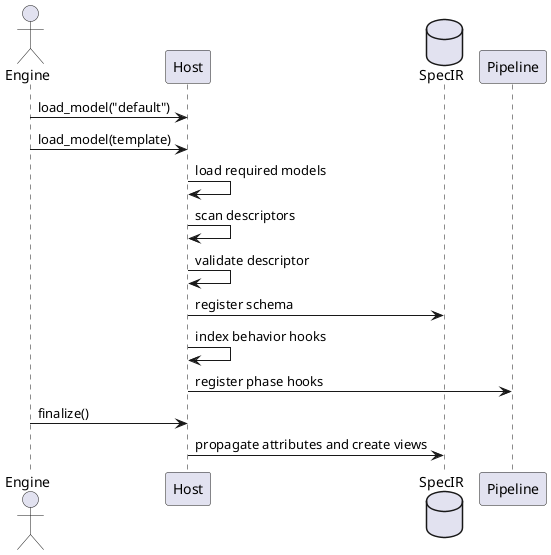

## Type Discovery Design

### FD: Type Model Discovery and Registration @FD-002

> traceability: [SF-005](@), [CSC-001](@), [CSU-008](@)

The host loads model descriptors from the filesystem. It registers schema data, behavior hooks, phase hooks, and analyze queries.

**Model order:** The engine loads `default` before the selected model. It loads manifest dependencies before the model that requires them. A descriptor with the same kind and identifier replaces the earlier descriptor.

**Model paths:** The host searches `$SPECCOMPILER_HOME/models/{model}` first. It then searches `{cwd}/models/{model}`. A missing selected or required model stops the build.

**Type discovery:** The host scans five directories under `models/{model}/types/`.

```list-table:tbl-type-categories{caption="Type category directory mapping"}
> header-rows: 1
> aligns: l,l,l,l

* - Category
  - Directory
  - Descriptor `kind`
  - Database table
* - Specifications
  - `specifications/`
  - `specification`
  - `spec_specification_types`
* - Objects
  - `objects/`
  - `object`
  - `spec_object_types`
* - Floats
  - `floats/`
  - `float`
  - `spec_float_types`
* - Relations
  - `relations/`
  - `relation`
  - `spec_relation_types`
* - Views
  - `views/`
  - `view`
  - `spec_view_types`
```

The host loads Lua files in sorted order. A type can use one file or a directory with `init.lua`. The declared kind must match the directory category.

**Descriptor contract:** Each module returns `{ kind, schema, hooks }`. The `hooks` field is optional. The host requires a known kind and a non-empty `schema.id`. It rejects invalid hooks and functions outside `hooks`.

```lua
return {
    kind = "object",
    schema = {
        id = "HLR",
        extends = "TRACEABLE",
        attributes = {
            { name = "status", type = "ENUM",
              values = { "Draft", "Approved" } },
        },
    },
    hooks = {
        render = function(ctx)
            return ctx.subject.element
        end,
    },
}
```

**Registration:** The host writes schema data to the applicable SpecIR table. It registers declared attributes and records the `extends` relationship. It indexes each behavior hook by kind, identifier, and hook name.

**Hook inheritance:** `get_hook_inherited` searches the descriptor and then its ancestors. This lookup applies to all descriptor kinds that support `extends`.

**Phase hooks:** An `on_<phase>` hook creates a pipeline handler named `<lowercase schema.id>_handler`. The `schema.phase_prerequisites` field defines its ordering constraints. Phase hooks do not enter the behavior-hook index.

**Analyze queries:** The host scans `models/{model}/analyze_queries/`. Each descriptor uses `kind = "analyze"`. Repeated policy keys use later-model precedence. A descriptor with `disabled = true` removes the policy key.

**Finalization:** After model loading, the host propagates inherited attributes. It creates analyze-query SQL views and checks required hooks. A `TABLE_VIEW` subtype without `build_block` stops the build.



#### LLR: Known Type Categories Are Scanned @LLR-EXT-020-01

The host shall scan the five known type-category directories in deterministic order.

> verification_method: Test

> traceability: [HLR-EXT-002](@)

#### LLR: Declared Hooks Are Indexed @LLR-EXT-021-01

The host shall index each valid behavior hook by kind, `schema.id`, and hook name.

> verification_method: Test

> traceability: [HLR-EXT-003](@)

#### LLR: Attribute Display Order @LLR-EXT-021-02

The standard object renderer shall render attributes listed in `schema.attr_order` first. It shall append other attributes in alphabetical order.

> verification_method: Test

> traceability: [HLR-EXT-003](@)

#### LLR: Schema Identifier Validation @LLR-EXT-022-01

The host shall stop model loading when a descriptor has no non-empty `schema.id`. It shall apply category defaults to valid schemas and register enum values.

> verification_method: Test

> traceability: [HLR-EXT-004](@)

#### LLR: Model Path Resolution Order @LLR-EXT-023-01

Model resolution shall check `SPECCOMPILER_HOME/models/{model}` before `{cwd}/models/{model}`.

> verification_method: Test

> traceability: [HLR-EXT-005](@)

#### LLR: Missing Model Paths Fail Fast @LLR-EXT-023-02

Model loading shall stop when neither model path contains the selected or required model.

> verification_method: Test

> traceability: [HLR-EXT-005](@)

#### LLR: Data View Resolution @LLR-EXT-024-01

Chart data loading shall use the inherited `dataset` hook for the requested view. Fixture modules outside the host index can use the loose-module loader.

> verification_method: Test

> traceability: [HLR-EXT-006](@)

#### LLR: Sankey Data Injection @LLR-EXT-024-02

For a Sankey series, chart injection shall copy returned `data` and `links` to the first series. It shall remove the conflicting dataset.

> verification_method: Test

> traceability: [HLR-EXT-006](@)

#### LLR: Unsupported View Data @LLR-EXT-024-03

Chart injection shall preserve the chart configuration when no view is specified or the view returns an unsupported shape.

> verification_method: Test

> traceability: [HLR-EXT-006](@)

#### LLR: Phase Hook Registration @LLR-094

The host shall register descriptor `on_<phase>` hooks with the pipeline.

> verification_method: Test

> traceability: [HLR-EXT-001](@)

#### LLR: Data View Discovery @LLR-095

The host shall register view descriptors from `models/{model}/types/views/`.

> verification_method: Test

> traceability: [HLR-EXT-007](@)

#### LLR: Hook Index Lookup @LLR-096

The host shall return direct hooks from its index and inherited hooks from the `extends` chain. An absent hook shall return nil.

> verification_method: Test

> traceability: [HLR-EXT-008](@)

---

### DD: Lua Type System with Inheritance @DD-CORE-006

SpecCompiler shall use Lua descriptor modules for model types.

> rationale: Lua supports computed schema data and co-locates behavior with its type. The `extends` field supports attribute and hook inheritance. Ordered model loading supports replacement without changes to the default model.
