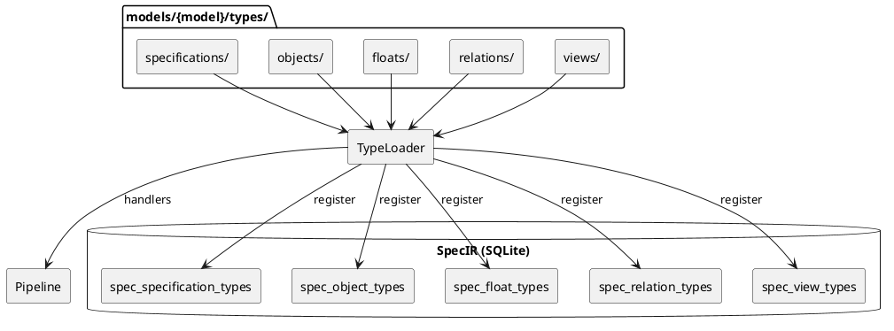

## Type System Architecture @type

### Overview

SpecCompiler uses a dynamic type system where models define available types for objects, [dic:float](#), relations, and views.



### Type Module Structure

Each extension point is ONE Lua file that returns ONE descriptor table. The host
reads only that table; it never sniffs which "magic key" exists.

```lua
-- Example: models/default/types/objects/hlr.lua
return {
    kind = "object",            -- object | float | view | relation | specification | verification
    schema = {                  -- declarative IR columns for this kind; schema.id is authoritative (not the filename)
        id = "HLR",
        long_name = "High-Level Requirement",
        extends = "TRACEABLE",  -- attribute + hook inheritance via the extends chain
        attributes = {
            { name = "status", type = "ENUM", values = { "Draft", "Review", "Approved", "Implemented" } },
        },
    },
    hooks = {                   -- the ONLY behaviour surface; an absent hook = host default
        render = function(ctx) ... end,
    },
}
```

Behaviour lives only under `hooks`. The host classifies each hook by name, infers
the module's role from the hooks present, validates each against the kind, and
rejects a function placed on any other top-level descriptor key. A pure-data type
(most objects/floats) carries `hooks = {}`; phase participation is declared under a
`on_<phase>` hooks (declared in `hooks`) the host synthesizes into the
pipeline.

### Type Categories

```list-table:tbl-type-system-categories{caption="Type categories and database tables"}
> header-rows: 1
> aligns: l,l,l

* - Category
  - Database Table
  - Key Fields
* - Specifications
  - spec_specification_types
  - id, long_name, extends, is_default
* - Objects
  - spec_object_types
  - id, long_name, extends, is_default (HLR, FD, CSC, CSU, VC, etc.)
* - Floats
  - spec_float_types
  - id, long_name, counter_group, needs_external_render
* - Relations
  - spec_relation_types
  - id, source_type_ref, target_type_ref, link_selector
* - Views
  - spec_view_types
  - id, inline_prefix, aliases
```

### Hook Contract

Every hook takes exactly ONE frozen context table as its sole argument, with a
polymorphic `subject` (the thing being acted on) and a `capability` (which hook).
The hook NAME selects one of two context tiers, which the host validates:

```list-table:tbl-hook-contract{caption="The two hook tiers: the hook name selects the context and the return type"}
> header-rows: 1
> aligns: l,l,l

* - Hook(s)
  - Tier / context
  - Returns
* - render, render_block, render_link, message
  - render ctx -- the EMIT walk; has pandoc/format; subject is the Pandoc element
  - Pandoc AST / string
* - dataset
  - data ctx -- subject.params
  - { source / data / links } dataset
* - build_block
  - data ctx -- subject.params
  - pandoc.Block
* - transform
  - data ctx -- subject.raw_content, subject.float
  - resolved-AST string
* - resolve
  - data ctx -- subject.target_text, subject.source_object_id
  - { target, ambiguous }
* - prepare_task, handle_result
  - data ctx -- subject.float/build_dir; subject.task/success/stdout/stderr
  - task table / DB write
```

A render hook reads `ctx.subject.*` plus the render core (`data`, `pandoc`, `log`,
`diagnostics`, `format`, `spec_id`, `model`, `config`, `host`); a data hook reads
`dctx.subject.*` plus the data core (`data`, `spec_id`, `log`). The context is
frozen (writes error) and its invariant core is asserted non-nil at build time. To
EXTEND a model, pick the hook whose name matches the intent -- the name determines
both the context it receives and the return type it owes.

### Loading Process

1. The host engine (`contract.registry`) loads `default` then each overlay model
   (later-wins-by-id), scanning `models/{model}/types/{category}/`.
2. Each file returns one descriptor; the host validates it (`kind`, `schema.id`,
   each hook valid for the kind, no behaviour on top-level keys) and emits the type
   row into the corresponding SpecIR table.
3. Each declared hook is eager-indexed into the `(kind, id) -> hook` map that every
   consumer reads via `get_hook` / `get_hook_inherited` (which walks the `extends`
   chain). An `on_<phase>` hook in `hooks` is synthesized into
   `pipeline:register_handler`.
4. `host:finalize()` propagates inherited attributes, creates the verification SQL
   views, and asserts required hooks (e.g. a TABLE_VIEW subtype must resolve a
   `build_block`).
