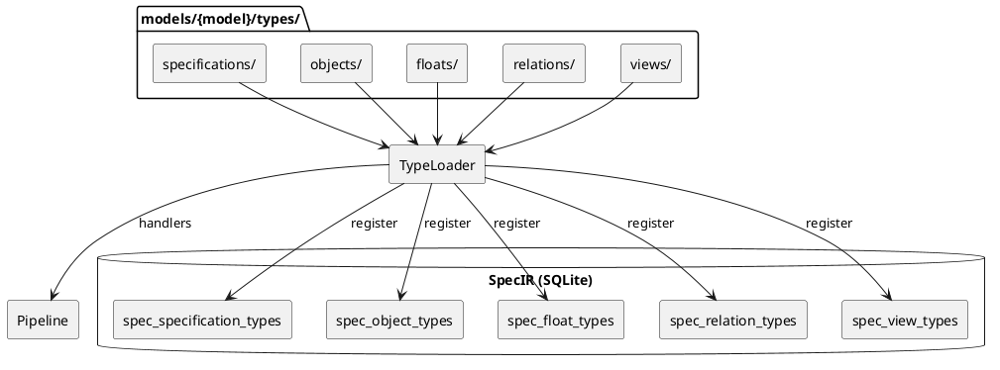

## Type System Architecture @type

### Overview

SpecCompiler uses a dynamic type system where models define available types for objects, [dic:float](#), relations, and views.



### Type Module Structure

Each extension module returns one descriptor table. The host reads the declared descriptor fields.

```lua
-- Example: models/default/types/objects/hlr.lua
return {
    kind = "object",            -- object | float | view | relation | specification | analyze
    schema = {                  -- SpecIR fields for this kind. schema.id is authoritative.
        id = "HLR",
        long_name = "High-Level Requirement",
        extends = "TRACEABLE",  -- attribute + hook inheritance via the extends chain
        attributes = {
            { name = "status", type = "ENUM", values = { "Draft", "Review", "Approved", "Implemented" } },
        },
    },
    hooks = {                   -- Optional custom behavior.
        render = function(ctx) ... end,
    },
}
```

Custom behavior belongs in `hooks`. The host validates each hook name against the descriptor kind. It rejects functions on other top-level keys. A data-only type can omit `hooks`. An `on_<phase>` function in `hooks` registers phase participation.

### Type Categories

```list-table:tbl-type-system-categories{caption="Type categories and database tables"}
> header-rows: 1
> aligns: l,l,l

* - Category
  - Database Table
  - Key Fields
* - Specifications
  - spec_specification_types
  - id, long_name, extends, is_default
* - Objects
  - spec_object_types
  - id, long_name, extends, is_default (HLR, FD, CSC, CSU, VC, etc.)
* - Floats
  - spec_float_types
  - id, long_name, counter_group, needs_external_render
* - Relations
  - spec_relation_types
  - id, source_type_ref, target_type_ref, link_selector
* - Views
  - spec_view_types
  - id, inline_prefix, aliases
```

### Hook Contract

Each hook accepts one frozen context table. The polymorphic `subject` field contains the hook input. The `capability` field identifies the hook. The hook name selects one of two context tiers:

```list-table:tbl-hook-contract{caption="The two hook tiers: the hook name selects the context and the return type"}
> header-rows: 1
> aligns: l,l,l

* - Hook(s)
  - Tier / context
  - Returns
* - render, render_block, render_link, message
  - render context with Pandoc and output-format fields
  - Pandoc AST / string
* - dataset
  - data context with `subject.params`
  - { source / data / links } dataset
* - build_block
  - data context with `subject.params`
  - pandoc.Block
* - transform
  - data context with `subject.raw_content` and `subject.float`
  - resolved-AST string
* - resolve
  - data context with target text and source identifier
  - { target, ambiguous }
* - prepare_task, handle_result
  - data context with task or result fields
  - task table / DB write
```

A render hook receives the render core and its subject. A data hook receives `data`, `spec_id`, `log`, and its subject. The host checks required context fields. It prevents assignment to top-level context fields. Each hook must return its documented type.

### Loading Process

1. The host engine (`contract.registry`) loads `default` then each overlay model
   (later-wins-by-id), scanning `models/{model}/types/{category}/`.
2. Each file returns one descriptor; the host validates it (`kind`, `schema.id`,
   each hook valid for the kind, no behaviour on top-level keys) and emits the type
   row into the corresponding SpecIR table.
3. Each declared hook is eager-indexed into the `(kind, id) -> hook` map that every
   consumer reads via `get_hook` / `get_hook_inherited` (which walks the `extends`
   chain). An `on_<phase>` hook in `hooks` is synthesized into
   `pipeline:register_handler`.
4. `host:finalize()` propagates inherited attributes, creates the analyze-query SQL
   views, and asserts required hooks (e.g. a TABLE_VIEW subtype must resolve a
   `build_block`).
