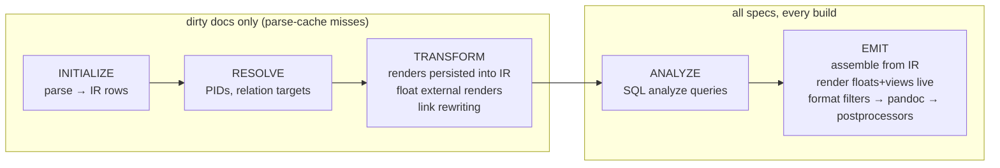
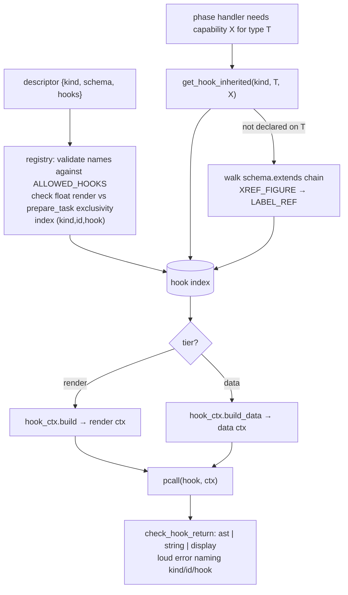
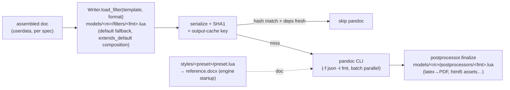
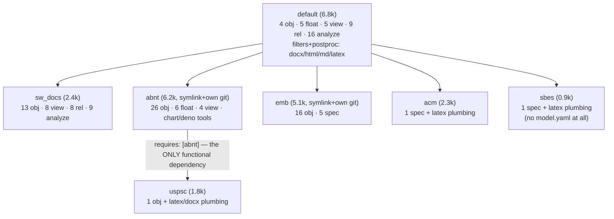
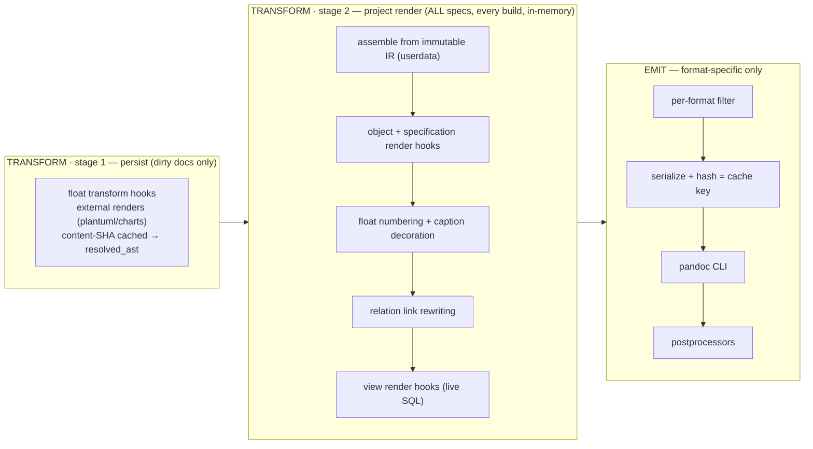

# Extension System — Current State, Review, and Simplification Plan

> Status: review draft (2026-07-05). No code changes proposed here have been applied.
> Method: full read of `src/` (18.3k lines) and all 7 models (~27k lines, symlinks
> followed), four parallel subsystem reviews, plus the verified hook-dispatch map
> from the 2026-07 incremental-build work. Diagrams are Mermaid (render in VS Code
> preview / GitHub); convert to `puml:` blocks if promoted into the SDD.

Target direction (decided by the maintainer, this review honors it):

1. **TRANSFORM owns all format-agnostic AST work. EMIT does format-specific
   transformation only** (format filters, pandoc CLI, postprocessors).
2. **Model authoring must get simpler** — less boilerplate, less engine knowledge,
   fewer forked copies between models.

---

## Part 1 — Current state, documented

### 1.1 The pipeline and what runs on what

Two different document sets flow through the phases. INITIALIZE/RESOLVE/TRANSFORM
receive only **dirty** documents (parse-cache miss: any `build_graph` node hash
changed). ANALYZE/EMIT receive **all** specs (`emit_contexts`), because analysis
and output must reflect whole-project state.

Incremental machinery (rebuilt 2026-07): the **parse cache** is one `build_graph`
table (root document is its own node; dirty = any node hash differs / node missing
/ no root node). The **emit cache** hashes the exact serialized document handed to
pandoc — anything that changes the rendered document invalidates by construction,
which is why EMIT-time rendering is always fresh and cross-document views (e.g.
traceability matrices) can never go stale again.

### 1.2 The extension contract as implemented

A model is a directory tree; the loader maps subdirectory → kind. Each descriptor
is `{ kind, schema, hooks }`. All behavior lives under `hooks` (top-level functions
are a register-time error). `contract/registry.lua` validates hook names against a
per-kind whitelist (`ALLOWED_HOOKS`), checks return types at dispatch, indexes
hooks by `(kind, id, hookname)`, and resolves inheritance by walking `extends`
(`get_hook_inherited`).

There are **three** behavior categories (the third is easy to miss):

| Category | Declared as | Receives | Dispatched by |
|---|---|---|---|
| Render-tier hook | `hooks.render`, `render_block`, `render_link`, `message` | frozen **render ctx** (`data, pandoc, format, spec_id, model, config, diagnostics, log` + `subject`) | the phase handler that owns that presentation step |
| Data-tier hook | `hooks.transform`, `prepare_task`, `handle_result`, `resolve`, `dataset`, `build_block` | frozen **data ctx** (`data, spec_id, log`; no pandoc/format) | the phase handler that owns that data step |
| Phase handler | `hooks.on_initialize` / `on_transform` / ... | `(data, contexts, diagnostics)` batch | the pipeline itself (topological sort with prerequisites) |

**The tier selects the context shape and the return contract — never the phase.**
The verified dispatch map (file:line refs in the codebase):

| Hook | Kind | Dispatcher | Actual phase | ctx |
|---|---|---|---|---|
| `render` | object | `spec_object_render_handler` | TRANSFORM (persisted) | render |
| `render` | specification | `specification_render_handler` | TRANSFORM (persisted) | render |
| `render` | float | `emit_float` (emitter) | EMIT | render |
| `render` / `render_block` | view | `emit_view` | EMIT | render |
| `render_link` | relation | `relation_link_rewriter` | TRANSFORM (persisted) | render |
| `message` | analyze | `analyze_handler` | ANALYZE | render |
| `transform` | float | `transform/spec_floats` (+ reused by `initialize/spec_relations` for table-float link extraction) | TRANSFORM (+INITIALIZE) | data |
| `prepare_task` / `handle_result` | float | `external_render_handler` | TRANSFORM | data |
| `resolve` | relation | `relation_resolver` | RESOLVE | data |
| `build_block` | view | `table_view.render_block` | EMIT | data |
| `dataset` | view | `data_loader` ← chart float | TRANSFORM | data |

### 1.3 The load-bearing asymmetry (why the phase story is confusing)

Object and specification renders are **persisted destructively**: the hook output
overwrites `spec_objects.ast` / `specifications.header_ast` in the DB
(`update_object_ast`, `update_specification_header_ast`). After TRANSFORM the
parsed IR no longer exists — the `ast` column holds presentation. Consequences,
all observed in code:

- Re-render requires re-parse; render can only ever run on dirty docs.
- One stored render serves every output format — the `format` field in an object
  render ctx is a fixed default, not a real value.
- Defensive complexity exists purely to survive re-rendering rendered content:
  `spec_object_render_handler` unwraps decoration divs and filters
  headers/attribute-blockquotes/`spec-object-attributes` before calling the hook.
- Link rewriting (`relation_link_rewriter`) mutates the same stored AST for dirty
  docs only → cached docs can keep stale anchors (known residual gap).

Floats and views are the opposite: rendered fresh at EMIT because their content is
cross-document (numbering groups, inbound relations, live SQL) — persisting them
per-doc is exactly what caused the stale-matrix bug fixed in 2026-07.

### 1.4 The registry, sectioned (contract/registry.lua, 913 lines)

The registry is the whole extension kernel in one file:

| Section | ~Lines | Purpose |
|---|---|---|
| FS adapter + model path probing | 23–82 | `SPECCOMPILER_HOME`/cwd probing, `CATEGORY_KIND` dir→kind map |
| Type-row INSERTs | 84–249 | per-kind schema→SQL emission, attribute registration |
| Attribute inheritance | 251–305 | fixpoint SQL walk of object `extends` chain |
| Contract metadata | 307–396 | `VALID_KINDS`, `ALLOWED_HOOKS`, dispatch-time return checking |
| `register()` | 447–575 | validation → type row → extends capture → hook index → resolver/analyze wiring |
| Analyze-query registry | 577–636 | append + (unused) override/disable machinery |
| Manifest + model loading | 638–820 | hand-rolled YAML `requires`, dir walk, `on_<phase>` handler registration |
| Finalize | 822–851 | required-hook assertions, attr propagation, analyze views |
| Accessors | 853–913 | `get_hook`, `get_hook_inherited`, `get_descriptor`, current-host |

Notable wiring facts (verified): `contexts` vs `emit_contexts` duplication lives in
`pipeline.execute` (dirty-only vs all-specs; cached ctx has `doc = nil`), and every
EMIT-side consumer must tolerate `ctx.doc == nil`. `base_ctx.config` duplicates
nine fields that already sit on `base_ctx` itself — two parallel copies of the same
values threaded into every hook ctx. `float_numbering` lives in `pipeline/emit/`
but runs `on_transform`; `relation_link_rewriter` participates in RESOLVE **and**
TRANSFORM; `analyze_handler` in ANALYZE **and** RESOLVE — directory names, comment
groupings in `register_core_handlers`, and actual phases disagree in several spots.

### 1.5 Handler map (who runs when, on what, dispatching which hooks)

Phase = which `on_<phase>` a handler defines; ordering within a phase = topological
sort over `prerequisites`. **A prerequisite naming a handler in another phase is
silently dropped** (`pipeline.lua:53-62`) — cross-phase prereqs are documentation
only (e.g. `analyze_handler`'s `{"relation_resolver"}` is inert).

| Handler | Phase | Contexts | Model hooks dispatched | Writes |
|---|---|---|---|---|
| specifications | INITIALIZE | dirty | — | `specifications` rows; mutates live AST (PID stamp/strip) |
| spec_objects | INITIALIZE | dirty | — | `spec_objects` (delete+insert) |
| structural_relations | INITIALIZE | dirty | — | resolved `spec_relations` |
| spec_floats_initialize | INITIALIZE | dirty | — | `spec_floats`; exports `get_type_prefix`/`find_parent_object` to sibling |
| spec_relations | INITIALIZE | dirty | float `transform` (data) — to scrape links from TABLE floats | `spec_relations` (unresolved) |
| spec_views | INITIALIZE | dirty | — | `spec_views` |
| attributes | INITIALIZE | dirty | — | `spec_attribute_values` |
| pid_generator | RESOLVE | dirty | — | PID columns |
| relation_resolver | RESOLVE | dirty (+stale cached specs) | relation `resolve` (data) | resolved targets/types |
| spec_floats_transform | TRANSFORM | dirty | float `transform` (data) | `resolved_ast`+`content_sha` |
| external_render_handler | TRANSFORM | dirty | `prepare_task`/`handle_result` (data) | `resolved_ast` via callbacks |
| specification_render_handler | TRANSFORM | dirty | specification `render` | **overwrites** `header_ast` |
| spec_object_render_handler | TRANSFORM | dirty | object `render` | **overwrites** `spec_objects.ast` |
| float_numbering *(lives in emit/)* | TRANSFORM | dirty | — | `spec_floats.number` |
| relation_link_rewriter | RESOLVE+TRANSFORM | dirty | relation `render_link` | **overwrites** object/attr/float ASTs |
| analyze_handler | ANALYZE (+RESOLVE) | all | analyze `message` | `ctx.verification` |
| fts_indexer | EMIT | all | — | `fts_*` tables |
| emitter | EMIT | all | float `render`, view `render`/`render_block` (via emit_float/emit_view) | output files + output_cache |

### 1.6 AST-work inventory under the target discipline

**Format-specific work correctly in EMIT today:** per-format filter application,
filtered-AST serialization + input-hash, pandoc CLI task building, postprocessors
(`emitter.lua`, `Writer.load_filter/load_postprocessor`, `pandoc_cli`).

**Format-agnostic AST work currently in `emit/`** (the material the target
discipline says belongs to TRANSFORM):

| Piece | What it does | Why it sits at EMIT today |
|---|---|---|
| `assembler.lua` | rebuild doc from IR; header-level normalization; H1/body insertion | needs pandoc **userdata** (`pandoc.read`) for `pandoc.write`; runs for all specs incl. cached |
| `emit_float.transform_floats_in_doc` | swap CodeBlocks for rendered floats; caption/bookmark decoration (format-agnostic markers converted by filters later) | caption **numbering** is cross-doc-fresh |
| `emit_view.transform_views_in_doc` | dispatch view render hooks | view content is **live SQL** over whole project — must stay fresh (stale-matrix bug class) |
| `float_resolver.resolve_floats` | classify resolved floats for emission | feeds emit_float; per-doc read |

The two hard reasons anything stays at EMIT: (1) cross-document freshness
(numbering, relations, live SQL) — currently guaranteed by re-running at EMIT with
the serialized-input hash as the cache; (2) the userdata round-trip (stored AST is
JSON; `pandoc.write` needs userdata rehydrated via `pandoc.read`).

### 1.7 Destructive persistence and its scaffolding

Five writes put rendered/rewritten AST **back onto the column that was their
input**, each dragging idempotency defenses behind it:

1. `spec_objects.ast` ← object render (`update_object_ast`) + composite heading
   patch. Defense: decode → unwrap `spec-object` Div → filter headers → filter
   attribute blockquotes → filter `spec-object-attributes`/`spec-object-header`
   divs — a five-step cascade that exists **only** because output overwrote input,
   and that re-implements Div-unwrap logic found in three other modules.
2. `spec_objects.ast` / `spec_attribute_values.ast` / `spec_floats.resolved_ast`
   ← link rewriting (idempotent by luck: rewriting `#anchor` yields `#anchor`).
3. `specifications.header_ast` ← spec render (re-rendered from fields; naturally idempotent).
4. `spec_floats.resolved_ast`+`content_sha` ← float transform (guarded by
   "only pending" query + content-SHA reuse).
5. `spec_floats.number` ← float numbering (recomputed from scratch).

Additional cross-cutting facts surfaced by the pipeline review: TABLE floats are
transformed **twice** (INITIALIZE link-scrape + TRANSFORM resolve) through the same
hook; float-type alias/prefix resolution is re-implemented **five times** with five
private caches (spec_floats init, spec_relations ×2, spec_floats transform,
relation_link_rewriter); `build_link_target` exists twice (rewriter private copy +
`view_utils.make_link_target` used by 7 model views); `encode_ast` is duplicated
across both render handlers; and `float_resolver.process_float` has a live arity
bug (`resolve_floats` passes `(float, log)` into `(float, build_dir, log)` —
harmless today only because the affected branch is pre-excluded).

### 1.8 The format layer (what EMIT would keep under the target discipline)

Extension points for a model author are pure path convention (no manifest, no
discovery): `filters/<format>.lua`, `postprocessors/<format>.lua`,
`styles/<preset>/preset.lua`. Known friction, verified:

- **Filters are dual-mode and run twice.** The same file must behave as an
  in-process module (`M.apply`) *and* as a pandoc `--lua-filter` (branching on the
  `FORMAT` global); the emitter applies it in-process (to make the cache key hash
  the post-filter AST) and then pandoc applies it again, relying on idempotency.
- A docx **preset leaks into format-agnostic float decoration** (caption position
  threaded into `emit_float.render_with_decoration`), and the preset is loaded
  twice per build (engine startup for reference.docx + emit).
- Format-name normalization (`html5→html`, `tex→latex`) is duplicated between
  `writer.lua` and `pandoc_cli.lua`; `resolve_project_path` and `file_exists`
  each exist twice.

### 1.9 The DB surface models actually use vs the one built for them

Two "stable API" layers exist — `db/views/public_api.lua` (six `public_*` views
with an explicit stability guarantee) and `db/views/eav_pivot.lua` (generated
`view_{type}_objects` pivots) — and **neither has a single consumer** in `src/` or
any model. Meanwhile model hooks reach straight into internal tables with
hand-written SQL: `traceability_matrix` re-implements the EAV `enum_ref→enum_values`
join by hand; `sw_docs/analyze_queries/sql.lua` builds its own views over raw
`spec_objects`/`spec_relations`; the resolved-relations-with-targets join that
models keep rewriting already exists internally as
`Queries.resolution.select_resolved_relations_with_targets`. The audience the
public views were built for (external BI/JS) uses only the FTS tables; the audience
that needed help (in-process model authors) got nothing.

### 1.10 The model layer, measured

Overlay reality: the engine hardcodes default-first; `model.yaml`'s `extends:`
field is **parsed by no one** (only `requires:` works). Hook usage census: abnt
and emb are almost purely `render` (20 and 15 declarations); sw_docs is
`message`×9 + `build_block`×7; only default exercises the full contract.

**The descriptor contract is not the problem.** The healthiest files prove it:
sw_docs leaf objects and the abnt float "re-labels" are 15-line, schema-only
descriptors with `hooks = {}` inheriting all behavior through `extends`. The debt
concentrates in what the contract does *not* cover:

| Copy-paste cluster | Size | Where |
|---|---|---|
| DOCX→PDF/LibreOffice finalize machinery (17 identical helpers) | ~369 lines | abnt ↔ emb postprocessors |
| LaTeX postprocessor helpers (escape, longtable rewriters, compile_pdf…) | 114–163 lines/pair | acm ↔ uspsc ↔ sbes |
| OOXML emit helpers re-implemented per DOCX filter (bypassing `infra/docx/ooxml_builder`) | 150–220 lines/pair | default ↔ abnt ↔ emb filters |
| 7 matrix views: raw 3–4-table SQL + manual `pandoc.SimpleTable` assembly | 101–224 lines each | sw_docs |
| Paper-metadata spec type (MAX_AUTHORS loop + `% speccompiler:` markers) | ~100 lines, ~90% identical | acm_paper ↔ sbes_paper |
| Document-skeleton objects (annex/appendix/abstract/pretextual…) | ~230 parallel lines | abnt ↔ emb |
| analyze-query stubs (18-line file pointing into a per-model `sql.lua`) | 25 files | default + sw_docs |
| Inline-view glue (prefix_matcher wiring + params mini-parser + Div wrapper) | ×7 views | default + abnt |

**"New model" experience today**: an sbes-class LaTeX model is ~80% copied
plumbing (LaTeX helpers, paper-metadata descriptor, assets) and ~20% genuinely
authored content.

---

## Part 2 — Findings, ranked

Ranking = value ÷ risk, grouped in five clusters. Every item carries evidence in
Part 1 or agent-verified file:line refs. Items marked ⚠ were re-verified with
`find -L` (models/abnt and models/emb are symlinks; plain recursive grep does not
descend them — one subsystem review initially mis-flagged `ooxml_builder` and
`section_manager` as dead when abnt consumes both).

### Cluster A — Dead weight (delete/fix; near-zero risk)

| # | Item | Evidence |
|---|---|---|
| A1 | Analyze-query override/disable machinery: all 25 policy_keys across 7 models are unique, no descriptor sets `disabled` — only the append path ever runs | registry.lua:577–636 |
| A2 | `KNOWN_PHASES.verify`: accepts `on_verify` handlers that no phase ever dispatches; zero users | registry.lua:386 |
| A3 | `pid_auto_generated` column: written on every insert, read by nothing ⚠ | schema/content.lua:103 |
| A4 | `content_sha` on `spec_objects`/`spec_relations`/`spec_attribute_values`/`spec_views`: write-only (only `spec_floats.content_sha` is read) ⚠ | transform/spec_floats.lua:69 |
| A5 | `float_resolver.process_float` arity bug: called `(float, log)` against `(float, build_dir, log)` — latent, currently masked | float_resolver.lua:15 vs :90 |
| A6 | `xml.clone` (no callers ⚠); `diagnostics.warnings` write-only array; `Diagnostics.new(log)` arg ignored; `config` emits `project` nobody reads; `output_formats` third format representation; `phase_handler` rejection guard for an API with zero users | agent-verified |
| A7 | Test-only presets (`test_preset_base/default`) shipped inside the production default model; `emb/slop/` 112KB scratch markdown; empty `uspsc/types/*` scaffold dirs; `gauss.lua`+`gaussian.lua` pair (confirm which is live) | models census |
| A8 | Stale docs in `data_loader` header (`generate` vs real hook name `dataset`) | data_loader.lua:14–33 |

*Not dead, keep:* `ooxml_builder`, `section_manager` (abnt consumes both ⚠),
`spawn_sync` (internal to task_runner), datatypes, validation_policy.

### Cluster B — Duplication in `src/` (consolidate; low risk)

| # | Item |
|---|---|
| B1 | Float-type alias/prefix resolution implemented **5×** with 5 private caches (spec_floats init, spec_relations ×2, spec_floats transform, relation_link_rewriter) → one resolver module |
| B2 | `spec_relations` imports sibling handler `spec_floats` for `get_type_prefix`/`find_parent_object` → move to neutral shared module (folds into B1) |
| B3 | Sourcepos Div-unwrap idiom hand-rolled in 4 modules → one `ast_utils` helper |
| B4 | `encode_ast` duplicated across both render handlers; JSON shape-discrimination duplicated between `assembler.decode_ast` and `ast_utils.extract_blocks` |
| B5 | Cross-doc link-target rule in 2 places (`relation_link_rewriter.build_link_target` private + `view_utils.make_link_target` used by 7 model views) |
| B6 | `resolve_project_path` ×2, `file_exists` ×2, format-name normalization ×2, logger's two near-identical adapter factories, preset_loader's dual extends-chain walk |
| B7 | TABLE floats transformed **twice** (INITIALIZE link-scrape + TRANSFORM resolve) through the same hook |

### Cluster C — Model-authoring API (the main ask; additive, medium effort)

| # | Item | Payoff |
|---|---|---|
| C1 | **Typed query helpers for hooks**: expose (on `data` or a `model_api`) "attributes-of-object, typed", "resolved relations for spec with target pid/anchor/caption" (internal query already exists: `Queries.resolution.select_resolved_relations_with_targets`), "objects of type with attributes" — and/or point models at the already-built, already-tested EAV pivot views (`view_{type}_objects`) and `public_*` views that today have **zero** consumers | kills most raw SQL in the 7 matrix views + inline views |
| C2 | **`build_table(headers, rows, opts)` host helper** (SimpleTable assembly + link cells) | each matrix view shrinks ~50% |
| C3 | **Host-side prefix dispatch**: registry already knows `inline_prefix`+aliases; pass the parsed remainder/params into view hooks instead of 7 views re-wiring prefix_matcher | deletes glue in every inline view |
| C4 | **`infra/format/docx/finalize.lua`**: absorb the 369-line LibreOffice/PDF block duplicated abnt↔emb; expose `finalize_docx(paths, config, log)` | −~700 lines across models |
| C5 | **Shared LaTeX utils** (escape, longtable/figure rewriters, compile_pdf, asset staging) consumed by acm/uspsc/sbes postprocessors | −~400 lines; new LaTeX model stops copying |
| C6 | **Declarative paper-metadata base spec type** (author_N blocks + `% speccompiler:` marker emission) | acm_paper/sbes_paper become schema-only |
| C7 | **Caption/label localization as data** (per-model caption table) — the abnt float re-labels already prove the shape; make it one file instead of 5 stubs | pattern for future locales |
| C8 | **analyze-query convention**: derive `view`/`policy_key`/SQL-key from filename; message + SQL in one file | deletes 25 stub files |

### Cluster D — Contract hygiene (register-time; medium risk, high author value)

| # | Item |
|---|---|
| D1 | Infer `kind` from directory (`CATEGORY_KIND` already exists); declaring it stays legal but mismatch remains an error |
| D2 | Make `model.yaml` authoritative and validated: honor or **remove** `extends:` (today silently dead), validate fields, require the file (sbes has none) |
| D3 | Schema is an open bag: `numbered`, `starts_on`, `attr_order`, `show_pid` are model-private conventions with silent-typo failure → per-kind known-field table, warn on unknown keys |
| D4 | Generic `required_hooks` on base types (today hard-coded to TABLE_VIEW→build_block only) |
| D5 | Document + enforce the dual-mode filter contract (in-process `M.apply` + pandoc `--lua-filter`), or eliminate the duality (see E4) |
| D6 | Leaf-local vs inherited schema-field split (`is_composite`/`pid_*` don't inherit; attributes do) — document at minimum, ideally validate |
| D7 | Split registry.lua (913 lines) along its existing seams: loader / contract+validation / hook index |

### Cluster E — Phase discipline & persistence (structural; the maintainer's doctrine)

| # | Item |
|---|---|
| E1 | Destructive AST persistence (5 write-back sites) forces the idempotency cascade and makes stored `ast` presentation, not IR |
| E2 | `contexts` vs `emit_contexts` duality: two parallel ctx lists, every EMIT consumer tolerating `doc == nil`, base_ctx.config duplicating nine fields |
| E3 | Directory/phase lies: `float_numbering` in `emit/` runs TRANSFORM; cross-phase prerequisites silently dropped; `register_core_handlers` comment groups wrong |
| E4 | Format filter runs **twice** per output (in-process for the cache key + `--lua-filter` in pandoc), an implicit-idempotency contract |
| E5 | DOCX preset leaks into format-agnostic float decoration; preset loaded twice per build |

---

## Part 3 — Target architecture and plan

### 3.1 Reconciling the doctrine with the freshness constraint

Adopted doctrine: **TRANSFORM owns all format-agnostic AST work; EMIT does
format-specific transformation only.** The one hard constraint (learned from the
2026-07 stale-matrix bug): anything whose content depends on cross-document state
— float numbering, relation-fed views, live SQL — must be recomputed every build.
Doctrine and constraint reconcile by splitting TRANSFORM into two stages:

Properties: `spec_objects.ast` / `header_ast` become **immutable parsed IR** (E1
eliminated, the unwrap/filter cascade deleted); every render/view/link hook sees
fresh whole-project state (the constraint holds by construction); the emit cache
still hashes the exact pandoc input, so the expensive subprocess is skipped exactly
as today; T1 keeps the expensive external renders incremental via content-SHA.
Measured basis for the added cost: the entire warm build of 10 docs × 40 objects is
~130 ms today — stage-2 Lua rendering for all docs is a fraction of one pandoc
spawn. The context duality (E2) collapses to one context list with a `dirty` flag:
INITIALIZE/RESOLVE/T1 filter on it, T2/ANALYZE/EMIT don't.

### 3.2 Phased plan

**P0 — Housekeeping (≈½ day, zero behavioral risk).**
Delete/fix all of Cluster A; fix the arity bug (A5); relocate test presets under
`tests/`; resolve gauss/gaussian; correct stale comments (A8). Gate: full suite
green (no new tests needed — deletions must not change any observable behavior).

**P1 — Authoring API, additive (≈2–4 days).**
C1→C3 first (query helpers + build_table + host-side prefix dispatch), each proven
by migrating a pilot: the 7 sw_docs matrix views (expected ≈−50% LOC each) and the
default inline views. Then C4/C5 (docx finalize + latex utils into `src/infra`),
proven by re-pointing abnt/emb/acm/uspsc/sbes postprocessors (expected ≈−1,100
duplicated lines across models). Then C6–C8. Everything additive: old paths keep
working until the pilots migrate. Gate per step: suite + model suites green;
LOC delta recorded.

**P2 — Contract hygiene (≈1–2 days).**
D1–D6 at register time (warnings first, errors after models are clean), D7 last
(mechanical split of registry.lua). Gate: suite green; a deliberate typo'd schema
field and a `model.yaml` with dead `extends:` must now warn/fail loudly (new
negative tests).

**P3 — Phase discipline (≈3–5 days; the structural change; do last, on a branch).**
Stepwise, each step suite-green before the next:
1. Make link rewriting non-destructive (compute into the in-memory doc; stop the
   three UPDATE write-backs). Kills the stale-anchor class.
2. Move object/spec render into the stage-2 assembly path; stop overwriting
   `ast`/`header_ast`; delete the unwrap/filter cascade and the marker classes it
   greps for.
3. Relocate `emit_float`/`emit_view`/`assembler`/`float_resolver` under
   `transform/` as stage 2 (they are already format-agnostic); `float_numbering`
   moves out of `emit/`.
4. Emitter shrinks to: filter → hash → pandoc → postprocessors. Decide E4 here:
   keep the in-process filter pass as the only one (drop `--lua-filter`) if
   output-identical, else document the dual contract.
5. Unify contexts (E2); fix the naming/comment lies (E3); TABLE double-transform
   (B7) resolves naturally — link scraping reads stage-1 `resolved_ast`.
Gates: full suite + model suites; golden-output byte-comparison on the abnt and
sw_docs example projects; benchmark (cold/warm/one-edit) within 10% of baseline
(current baseline: 2.6 s / ~0.13 s / ~0.38 s on the 10-doc synthetic project);
the four incremental tests (vc_009, vc_010, vc_pipe_013, vc_pipe_014) unchanged.

**Sequencing rationale:** P0–P2 are independent of P3 and shrink the surface P3
must move. P3 goes last, on a worktree branch, with the suite hardened by P1's
pilot migrations.

### 3.3 Acceptance criteria

- "New model" (sbes-class): from ~80% copied plumbing to **model.yaml + 1 spec
  descriptor + preset + assets**, ≤300 authored lines.
- Models stop declaring raw SQL for the recurring joins (matrix/inline views use
  C1/C2 helpers); remaining inline SQL is genuinely model-specific.
- `src/` net LOC down (A+B clusters ≈ −700 lines; models ≈ −1,500 duplicated
  lines after C4/C5 pilots).
- Every hook's phase is what its directory and the SDD say it is; the SDD
  (storage/output/pipeline design docs) updated in the same PRs that move code.
- All 108 e2e tests + model suites green at every phase gate; benchmarks within
  budget; golden outputs byte-identical (or diffs reviewed and accepted).

### 3.4 Explicitly rejected

- **Materializing view/relation-fed content per document** (any variant of
  resolved_data): re-introduces the stale-output class removed in 2026-07.
- **Per-spec dependency-model hashes** for the emit cache: the serialized-input
  hash is strictly more correct.
- **Deleting the EAV pivot / `public_*` views**: they are tested, documented
  external contracts (VC-033); the fix is to *use* them (C1), not remove them.
- **Merging models into src**: symlinked models with their own git repos (abnt,
  emb) are a distribution decision out of scope here; the review only notes the
  `find -L` search hazard and the committed build artifacts inside them.
