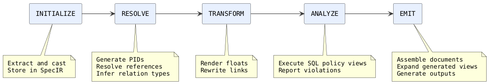
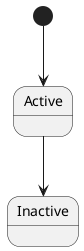
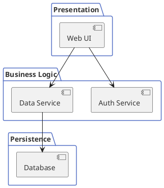

# SpecCompiler Core User Manual @MANUAL

> version: 1.0

> document_id: SC-UM-001

## COVER: SpecCompiler Core User Manual

> subtitle: Structured Document Processing Pipeline

> author: SpecCompiler Project

> date: 2026-02-21

> version: 1.0

> document_id: SC-UM-001

This manual uses `template: default` and contains executable examples. The default model renders the floats, references, diagrams, views, and math examples. Chart examples require an overlay model that defines the `chart:` float. Run `specc build docs/user_docs/project.yaml` to generate the manual and its companion guides.

## INDEX

`toc:`

## Introduction

### What is SpecCompiler?

SpecCompiler is the reference compiler for **CommonSpec**, a structured Markdown language for typed, traceable specifications. It lowers CommonSpec into SpecIR (a SQLite-backed intermediate representation) and generates multiple output formats (DOCX, HTML5, GitHub-Flavored Markdown, and JSON Pandoc AST). It provides:

- **Structured authoring**: Define requirements, designs, and verification cases using a consistent syntax.
- **Traceability**: Link objects together with `abbrev: Project Identifier (PID)` and `#label` references.
- **Validation**: Check data integrity with `abbrev: Structured Query Language (SQL)` analyze queries against the `abbrev: Specification Intermediate Representation (SpecIR)`.
- **Multi-format output**: Generate Word documents and web content from a single source.

SpecCompiler processes documents through a five-phase pipeline: INITIALIZE, RESOLVE, TRANSFORM, ANALYZE, and EMIT, as illustrated in [plantuml:diag-pipeline](#).

### Scope

This manual covers:

- Installation and verification of the SpecCompiler-Core Docker image (see [MANUAL-sec3](@)).
- Configuration of project files (`project.yaml`) as described in [section:project-configuration](#).
- Authoring specification documents using CommonSpec syntax ([MANUAL-sec5](@)).
- Invocation of the tool and interpretation of its outputs ([section:invocation](#)).
- Verification diagnostics and policy-key reference.
- Incremental build behavior and cache management.
- Type system configuration and custom model creation; for a detailed walkthrough, see [section:model-directory-layout](#) in the companion model guide.
- Troubleshooting common problems.

### Pipeline Summary

The processing pipeline consists of five phases:

1. **INITIALIZE** -- Extract specifications, spec objects, attributes, floats, relations, and view definitions from the parsed `abbrev: Pandoc Abstract Syntax Tree (AST)` into the SpecIR stored in `abbrev: SQLite Database (SQLite)`, casting attribute values into typed columns.
2. **RESOLVE** -- Generate missing PIDs, resolve relation targets, and infer relation types from model constraints (see [math:eq-specificity](#)).
3. **TRANSFORM** -- Resolve and number floats, render typed content, and rewrite resolved links.
4. **ANALYZE** -- Execute SQL policy views against SpecIR, apply configured severities, and report violations.
5. **EMIT** -- Assemble Pandoc documents from SpecIR, expand generated views, and generate configured outputs via parallel Pandoc subprocesses.



```json
{
  "xAxis": { "type": "category", "data": ["INITIALIZE", "RESOLVE", "TRANSFORM", "ANALYZE", "EMIT"] },
  "yAxis": { "type": "value", "name": "Hook count" },
  "series": [{ "type": "bar", "data": [6, 2, 5, 1, 3], "itemStyle": { "color": "#5470c6" } }]
}
```

The ECharts config above (hook counts per phase) renders as a bar chart under any model that provides the `chart:` float, such as `abnt`; the counts reflect the default model. Custom models may add hooks in any phase.

## Installation

### Prerequisites

The following are required to run SpecCompiler-Core:

```list-table:tbl-prerequisites{caption="Runtime prerequisites"}
> header-rows: 1
> aligns: l,l,l

* - Prerequisite
  - Minimum Version
  - Notes
* - Container engine
  - Docker 20.10+ or Podman 4+
  - Docker Desktop, Docker Engine, or Podman (daemon/VM must be running)
* - Disk space
  - 2 GB
  - For the container image and build artifacts
* - Host OS
  - Linux, macOS, or Windows
  - The container runs Ubuntu 24.04
```

All dependency versions are pinned in `scripts/versions.env`. 

### Installing

One command on Linux, macOS, or WSL2 (requires docker or podman):

```src.bash:src-install-oneliner{caption="Container install (Linux/macOS/WSL2)"}
curl -fsSL https://raw.githubusercontent.com/SpecIR/SpecCompiler/main/scripts/install.sh | bash
```

One command on Windows, in PowerShell (after Docker Desktop or Podman is installed):

```src.bash:src-install-windows{caption="Container install (Windows PowerShell)"}
irm https://raw.githubusercontent.com/SpecIR/SpecCompiler/main/scripts/install.ps1 | iex
```

`install.sh` installs the `specc` `abbrev: Command-Line Interface (CLI)` wrapper at `~/.local/bin/specc` and writes the engine and image reference to `~/.config/speccompiler/env`; the Windows installer places `specc` under `%LOCALAPPDATA%\SpecCompiler\bin` and adds it to the user PATH. If a local image exists it is used automatically; otherwise, the GHCR image is pulled on first use.

### Building the Image

There is a single image, built on Ubuntu 24.04 (`Dockerfile`): the stock apt pandoc, the four compiled Lua C extensions, the SpecCompiler Lua source, and the optional renderers (deno for model-owned `chart:` floats, PlantUML for `puml:` diagrams, python/reqif for ReqIF interop). No compiler toolchain, no pandoc build. To build it locally instead of pulling from GHCR, from the repository root:

```src.bash:src-build-image{caption="Build and install via Docker"}
docker build -t speccompiler-core:latest .
bash scripts/install.sh
```

### Verifying Installation

After building, verify the image is available:

```src.bash:src-verify-image{caption="Verify Docker image availability"}
docker images speccompiler-core
```

To verify the tool runs correctly, navigate to a directory containing a `project.yaml` file and run:

```src.bash:src-run-wrapper{caption="Run wrapper command"}
specc build
```

### The specc Wrapper

The `specc` command is a single wrapper shared by every install mode. Its mode is read from `~/.config/speccompiler/env`:

```list-table:tbl-wrapper-modes{caption="Wrapper modes"}
> header-rows: 1
> aligns: l,l

* - Mode
  - Behavior
* - `SPECC_MODE=image`
  - Runs the container image via docker or podman (written by `install.sh`)
* - `SPECC_MODE=native`
  - Invokes the host pandoc with the compiled extensions (written by `install-native.sh`)
```

The command surface is `specc build [project.yaml]` (default file: `project.yaml`).

In image mode, the wrapper runs `docker run --rm` (or `podman run --rm`) with:

- `--user "$(id -u):$(id -g)"` -- Preserves host UID/GID (docker; rootless podman uses `--userns=keep-id` instead).
- `-v "$(pwd):/workspace"` -- Mounts current directory.
- `-e "SPECCOMPILER_LOG_LEVEL=${SPECCOMPILER_LOG_LEVEL:-INFO}"` -- Passes log level.

Inside the container, the same wrapper runs in native mode and invokes Pandoc with the SpecCompiler Lua filter. The `-o /dev/null` Pandoc flag is intentional -- actual output files are generated by the EMIT phase.

## Project Configuration

All project configuration is specified in a `project.yaml` file located in the project root directory.

### Complete Configuration Reference

```src.yaml:src-project-yaml{caption="project.yaml reference"}
# ============================================================================
# Project Identification (REQUIRED)
# ============================================================================
project:
  code: MYPROJ          # Project code identifier (string, required)
  name: My Project SRS  # Human-readable project name (string, required)

# ============================================================================
# Type Model (REQUIRED)
# ============================================================================
template: default        # Type model name (string, default: "default")
                         # Must match a directory under models/

# ============================================================================
# Logging Configuration (OPTIONAL)
# ============================================================================
logging:
  level: info            # DEBUG | INFO | WARN | ERROR (default: "INFO")
  format: auto           # auto | json | text (default: "auto")
  color: true            # ANSI color codes (default: true)

# ============================================================================
# Validation Policy (OPTIONAL)
# ============================================================================
validation:
  missing_required: ignore
  cardinality_over: ignore
  invalid_cast: ignore
  invalid_enum: ignore
  invalid_date: ignore
  bounds_violation: ignore
  dangling_relation: ignore
  unresolved_relation: ignore

# ============================================================================
# Input Files (REQUIRED)
# ============================================================================
output_dir: build/       # Base output directory (default: "build")

doc_files:               # Markdown files to process, in order
  - srs.md
  - sdd.md

# ============================================================================
# Output Format Configurations (OPTIONAL)
# ============================================================================
outputs:
  - format: docx
    path: docx/{spec_id}.docx
  - format: html5
    path: www/{spec_id}.html

# ============================================================================
# DOCX Configuration (OPTIONAL)
# ============================================================================
docx:
  preset: null           # Style preset name (models/{template}/presets/)
  # reference_doc: assets/reference.docx  # Custom Word reference

# ============================================================================
# HTML5 Configuration (OPTIONAL)
# ============================================================================
html5:
  number_sections: true
  table_of_contents: true
  toc_depth: 3
  standalone: true
  embed_resources: true
  resource_path: build

# ============================================================================
# Bibliography and Citations (OPTIONAL)
# ============================================================================
bibliography: refs.bib
csl: ieee.csl
```

### Required Fields

```list-table:tbl-required-fields{caption="Required project fields"}
> header-rows: 1
> aligns: l,l,l

* - Field
  - Type
  - Description
* - `project.code`
  - string
  - Project code identifier
* - `project.name`
  - string
  - Human-readable project name
* - `doc_files`
  - list
  - One or more Markdown file paths to process
```

### Default Values

```list-table:tbl-default-values{caption="Default configuration values"}
> header-rows: 1
> aligns: l,l,l

* - Field
  - Default
  - Notes
* - `template`
  - `default`
  - Built-in base model is always loaded
* - `output_dir`
  - `build`
  - Also stores `specir.db`
* - `logging.level`
  - `INFO`
  - Overridden by `SPECCOMPILER_LOG_LEVEL` env var
```

## Document Authoring

CommonSpec extends standard Markdown with six constructs for specification documents. The syntax uses existing Markdown constructs (headers, blockquotes, code blocks, links) with specific patterns that the pipeline recognizes. See the CommonSpec Language Specification for the formal definition.

### Specifications

Level 1 headers declare the top-level document container.

**Pattern:** `# type: Title @PID`

```src.markdown:src-specification-pattern{caption="Specification declaration"}
# srs: Software Requirements Specification @SRS-001
```

### Spec Objects

Level 2-6 headers declare requirements, design elements, sections, or any typed element.

**Pattern:** `## type: Title @PID`

```src.markdown:src-object-pattern{caption="Spec object declaration"}
## hlr: User Authentication @HLR-001
### llr: Password Validation @LLR-001
#### section: Implementation Notes
```

If `@PID` is omitted, a PID is auto-generated using the type's `pid_prefix` and `pid_format`.

A spec object owns the content that follows it until the section is closed. A section closes automatically at the next header of equal or shallower level, and child headers must go exactly one level deeper (jumping from `##` to `####` is reported as a broken hierarchy). To close a section **without** opening a new heading -- so that the next paragraphs or `include`d sections belong to the parent -- end it with a `----` thematic break:

```src.markdown:src-section-close{caption="Closing a section with ----"}
## Pesquisa-Ação @SEC-PA

### Considerações Iniciais

Intro that belongs to "Considerações Iniciais".

----

This paragraph belongs to the chapter, not the section above.
```

The `----` is consumed (it never renders as a horizontal rule). Do not use an empty `##` as a "section reset": an empty heading is rejected because it would render as a blank numbered chapter and shift all later numbering.

### Attributes

Blockquotes declare attributes using the `key: value` pattern. They belong to the most recently opened Specification or SpecObject header and do not need to appear immediately after it:

```src.markdown:src-attribute-pattern{caption="Attribute declaration"}
## hlr: User Authentication @HLR-001

> priority: High

> status: Draft

> rationale: Required by security policy
```

Rules:

- One blockquote declares ONE attribute. Distinct attributes are separate blockquotes, separated by a blank line.
- The first line must match `key: value` (where `key` is `[A-Za-z0-9_]+`) AND `key` must be a declared attribute of the enclosing object's type (its own schema or one inherited through `extends`; matching is case-insensitive). Otherwise the blockquote is plain prose — so quotes like `> Note: remember this` are safe. An undeclared `key:`-shaped blockquote raises an `unknown_attribute` warning to make typos visible.
- Multi-line values are supported: every later `> ` line or `>`-separated paragraph of the same blockquote continues the value, even when it looks like `key: value` itself.
- Specification-level metadata (blockquotes under the `#` title, e.g. `title`, `author`, `version`) is permissive: any key is stored, with an `unknown_spec_attribute` warning when the key is not declared for the specification's type.
- Supported datatypes: `STRING`, `INTEGER`, `REAL`, `BOOLEAN`, `DATE` (YYYY-MM-DD), `ENUM`, `XHTML`.

### Floats

Fenced code blocks with a typed first class declare numbered elements.

**Pattern:** `` ```type.lang:label{key="val"} ``

#### PlantUML Diagram

````src.markdown:src-plantuml-float-syntax{caption="PlantUML float syntax"}

````

#### Table

````src.markdown:src-table-float-syntax{caption="Table float syntax"}
```list-table:tbl-interfaces{caption="External Interfaces"}
> header-rows: 1
> aligns: l,l,l

* - Interface
  - Protocol
  - Direction
* - GPS
  - ARINC-429
  - Input
```
````

#### CSV Table

The `abbrev: Comma-Separated Values (CSV)` float alias provides a compact syntax for tabular data:

````src.markdown:src-csv-float-syntax{caption="CSV float syntax"}
```csv:tbl-data{caption="Sample Data"}
Name,Value,Unit
Temperature,72.5,F
Pressure,1013.25,hPa
```
````

Both `csv` and `list-table` produce TABLE floats. Use `csv` for simple tabular data and `list-table` for tables with rich Markdown content in cells. See [section:floats-in-practice](#) for live examples of each.

#### Listing (Code)

````src.markdown:src-listing-float-syntax{caption="Listing float syntax"}
```listing.c:lst-init{caption="Initialization Routine"}
void init(void) {
    setup_hardware();
}
```
````

#### Chart (ECharts)

The `default` model does not define the `CHART` float. Use an overlay model that defines `CHART` and its renderer. Install any external tool required by that model.

````src.markdown:src-chart-float-syntax{caption="Chart float syntax"}
```chart:chart-coverage{caption="Test Coverage"}
{
  "xAxis": { "data": ["Module A", "Module B"] },
  "series": [{ "type": "bar", "data": [95, 87] }]
}
```
````

Charts support data injection via view modules. Add `view="gauss"` and `params="mean=0,sigma=1"` to the code fence attributes to inject generated data into the ECharts configuration at render time. The *Chart with Data View Injection* example below shows the syntax (the `gauss` view ships with the overlay model that provides charts).

#### Math

````src.markdown:src-math-float-syntax{caption="Math float syntax"}
```math:eq-force{caption="Newton's Second Law"}
F = ma
```
````

Math floats use AsciiMath notation and are rendered to MathML for HTML5 output and OMML for DOCX. See [math:eq-specificity](#) and [math:eq-latency](#) for live examples in this manual.

#### Float Syntax Summary

```list-table:tbl-float-syntax{caption="Float syntax components"}
> header-rows: 1
> aligns: l,l

* - Component
  - Description
* - `type`
  - Float type identifier (for example `figure`, `plantuml`, `csv`, `list-table`, `listing`, `chart`, `math`)
* - `.lang`
  - Optional language hint for syntax highlighting
* - `:label`
  - Float label for cross-referencing; must be unique within the specification
* - `{key="val"}`
  - Key-value attributes; common attribute: `caption`
```

### Relations (Links)

Links use the pattern `[content](selector)`. Selectors are **not hardcoded** -- they are registered by relation types in the model's type system. Each relation type declares a `link_selector` field, and the pipeline uses it for resolution and type inference. The `default` model registers the following selectors:

```list-table:tbl-selectors{caption="Default model selectors"}
> header-rows: 1
> aligns: l,l,l

* - Selector
  - Registered by
  - Resolution
* - `@`
  - `PID_REF` base (XREF_SEC and model-specific types)
  - PID lookup: same-spec first, then cross-document fallback
* - `#`
  - `LABEL_REF` base (XREF_FIGURE, XREF_TABLE, XREF_LISTING, XREF_MATH, XREF_SECP)
  - Scoped label resolution: local scope, then same-spec, then global
* - `@cite`
  - XREF_CITATION
  - Rewritten to pandoc Cite element (parenthetical)
* - `@citep`
  - XREF_CITATION
  - Rewritten to pandoc Cite element (in-text)
```

Custom models can register additional selectors by defining relation types with new `link_selector` values.

```list-table:tbl-relation-syntax{caption="Relation syntax patterns"}
> header-rows: 1
> aligns: l,l,l

* - Syntax
  - Example
  - Description
* - `[PID](@)`
  - `[HLR-001](@)`
  - Reference by PID
* - `[type:label](#)`
  - `[fig:diagram](#)`
  - Typed float reference
* - `[scope:type:label](#)`
  - `[REQ-001:fig:detail](#)`
  - Scoped float reference
* - `[key](@cite)`
  - `[smith2024](@cite)`
  - Parenthetical citation
* - `[key](@citep)`
  - `[smith2024](@citep)`
  - In-text citation
```

#### Type Inference

After a link is resolved, the inference algorithm scores it against all registered relation types using 4 unweighted dimensions. Each matching dimension adds +1 to the specificity score. A constraint mismatch eliminates the candidate entirely. The total score for a candidate is computed as:

```math:eq-specificity{caption="Relation Type Specificity Score"}
S = sum_(i=1)^(4) d_i , quad d_i in {0, 1}
```

The four dimensions (`eq: d_1` through `eq: d_4`) correspond to selector, source attribute, source type, and target type as shown in [list-table:tbl-inference-scoring](#):

```list-table:tbl-inference-scoring{caption="Type inference scoring dimensions"}
> header-rows: 1
> aligns: l,c,l,c

* - Dimension
  - Match
  - Constraint mismatch
  - No constraint (NULL)
* - **Selector** (`@`, `#`, `@cite`, etc.)
  - +1
  - Eliminated
  - +0
* - **Source attribute**
  - +1
  - Eliminated
  - +0
* - **Source type**
  - +1
  - Eliminated
  - +0
* - **Target type**
  - +1
  - Eliminated
  - +0
```

The highest-scoring candidate wins. If two candidates tie, the relation is marked ambiguous. For example, `[fig:diagram](#)` resolving to a FIGURE float will match XREF_FIGURE (selector `#` + target type FIGURE = specificity `eq: S = 2`) over the generic `LABEL_REF` base (selector `#` only = specificity `eq: S = 1`).

### Views

Inline code with a specific prefix declares view placeholders:

```src.markdown:src-inline-view{caption="Inline view placeholder"}
`toc:`
```

Default model view types:

```list-table:tbl-view-types{caption="Default view types"}
> header-rows: 1
> aligns: l,l,l

* - Type
  - Aliases
  - Description
* - `toc`
  - ---
  - `abbrev: Table of Contents (TOC)` from spec object headings
* - `lof`
  - `lot`
  - List of floats (figures, tables, etc.)
* - `abbrev`
  - `sigla`, `acronym`
  - Define an abbreviation inline: `abbrev: Full Meaning (ABBR)`
* - `abbrev_list`
  - `sigla_list`, `acronym_list`
  - Render a sorted table of all abbreviations defined via `abbrev:`
* - `math_inline`
  - `eq`, `formula`
  - Inline math expression rendered to MathML/OMML
* - `gauss`
  - `gaussian`, `normal`
  - Generate Gaussian distribution data for chart floats
```

### Body Content

Prose paragraphs, lists, and tables between headers accumulate to the most recently opened Specification or Spec Object.

### File Includes

Split large documents into multiple files using fenced code blocks with the `include` class:

````src.markdown:src-file-include{caption="Include directive syntax"}
```include
path/to/chapter1.md
path/to/chapter2.md
```
````

Each line is a file path relative to the including document's directory. Absolute paths are also supported. Lines starting with `#` are treated as comments and ignored.

Include blocks are expanded recursively before the pipeline runs. Circular includes are detected and produce an error. The maximum nesting depth is 100 levels.

During expansion, SpecCompiler shifts all headings in an included file by the same amount. The shallowest heading becomes a child of the active heading. For example, an include under `##` changes an included `#` to `###`. It changes the included `##` to `####`. SpecCompiler preserves relative depths and reports skipped levels. Nested includes combine these shifts. A `----` marker before the directive reduces the active level by one:

````src.markdown:src-include-level-shift{caption="Include heading levels are relative to the include point"}
## Design

Content of Design. The include below nests under Design: the included
file's `#` becomes `###`.

```include
design_details.md
```

----

The `----` closed Design, so this include becomes a sibling `##` section:

```include
next_chapter.md
```
````

SpecCompiler positions an included file relative to its shallowest heading. The first heading can have any level. Nested includes can produce Pandoc heading levels greater than 6. SpecCompiler preserves these levels. Each output format renders them according to its capabilities.

Included files are tracked in the build graph for incremental builds -- a change to any included file triggers a rebuild.

## Using the Default Model

### Rationale

The `default` model ships a complete document authoring toolkit so that authors can write structured technical documents without defining custom types. It provides:

- **Numbered floats** -- figures, tables, code listings, math equations, and PlantUML diagrams, each with automatic numbering and captions.
- **Typed cross-references** -- relation types that resolve `@` and `#` links to specific float and object categories, enabling the pipeline to render appropriate display text (for example, "Figure 3" or "Table 1").
- **Bibliography citations** -- integration with Pandoc's citeproc for parenthetical and in-text citation rendering from BibTeX files.
- **Content views** -- generated content blocks such as TOC, list of figures, abbreviation tables, and inline math.

The following subsections demonstrate these features with live floats and cross-references. Every float, view, and link shown below is processed by SpecCompiler when this manual is built.

### Floats in Practice

A SpecCompiler document can use all default float types. Each float has a type prefix, a label for cross-referencing, and a caption. The examples below are live -- they are rendered when this manual is processed.

#### Architecture Diagram (PlantUML)



#### Component Table (list-table)

```list-table:tbl-components{caption="System Components"}
> header-rows: 1
> aligns: l,l,l

* - Component
  - Layer
  - Technology
* - Web UI
  - Presentation
  - React
* - Auth Service
  - Business Logic
  - Node.js
* - Data Service
  - Business Logic
  - Python
* - Database
  - Persistence
  - PostgreSQL
```

#### Performance Metrics (CSV)

```csv:tbl-metrics{caption="Performance Metrics"}
Metric,Target,Actual,Status
Response time (ms),200,185,Pass
Throughput (req/s),1000,1120,Pass
Error rate (%),1.0,0.3,Pass
Memory usage (MB),512,487,Pass
```

#### Initialization Code (Listing)

```listing.python:lst-init{caption="Service Initialization"}
def initialize(config):
    db = connect(config.db_url)
    auth = AuthService(db)
    return Application(auth, db)
```

#### Latency Model (Math)

```math:eq-latency{caption="Expected Latency"}
L = T_(network) + T_(processing) + T_(db)
```

#### Throughput Chart (ECharts)

```json
{
  "xAxis": { "type": "category", "data": ["Auth", "Data", "Search", "Notify"] },
  "yAxis": { "type": "value", "name": "req/s" },
  "series": [{ "type": "bar", "data": [1200, 3400, 890, 2100], "itemStyle": { "color": "#91cc75" } }]
}
```

### Cross-References

Every float and object defined above can be referenced from prose. The following paragraph demonstrates cross-reference resolution using the `#` selector.

The system architecture is depicted in [plantuml:diag-layers](#). Component details, including the technology stack for each layer, are listed in [list-table:tbl-components](#). Performance targets and actuals are compared in [csv:tbl-metrics](#) -- all four metrics pass their thresholds. The initialization logic is shown in [listing:lst-init](#), and the latency model driving performance requirements is defined by [math:eq-latency](#). Finally, throughput measurements by module are described by the chart config shown above, which renders as a chart under overlay models that provide the `chart:` float.

The `@` selector resolves by PID and works across documents. For example, this sentence references the introduction of this manual: [MANUAL-sec2](@). Cross-document references to the companion guides also work; see [section:model-directory-layout](#) for the model directory layout and [section:style-presets](#) for DOCX style presets.

```list-table:tbl-xref-selectors{caption="Cross-reference selector comparison"}
> header-rows: 1
> aligns: l,l,l

* - Selector
  - Syntax
  - Resolution
* - `@` (PID)
  - `[PID](@)`
  - Exact PID lookup. Same-spec first, then cross-document fallback. Never ambiguous.
* - `#` (Label)
  - `[type:label](#)`
  - Scoped resolution: local scope, then same specification, then global. May be ambiguous if multiple matches at the same scope level.
```

### Section References

Headers without an explicit `TYPE:` prefix default to the SECTION type. Sections receive auto-generated PIDs and labels that can be used for cross-referencing:

- **PID format**: `{spec_pid}-sec{depth.numbers}` -- for example, `SRS-sec1`, `SRS-sec1.2`, `SRS-sec2.3.1`. Use the `@` selector: `[SRS-sec1.2](@)`.
- **Label format**: `section:{title-slug}` -- for example, `## Introduction` produces the label `section:introduction`. Use the `#` selector: `[section:introduction](#)`.

The `@` selector performs an exact PID lookup and is never ambiguous. The `#` selector uses scoped resolution (closest scope wins), which is useful when multiple specifications have sections with similar names.

For cross-document section references with the `#` selector, use the explicit scope syntax: `[SPEC-A:section:design](#)` to target a section labeled "design" within the specification whose PID is `SPEC-A`.

This manual references its own sections using both selectors. Here are examples that resolve within this document:

- By PID: [MANUAL-sec3](@) links to Installation, [MANUAL-sec5](@) links to Document Authoring.
- By label: [section:pipeline-summary](#) links to Pipeline Summary, [section:troubleshooting](#) links to Troubleshooting.

Cross-document references work identically. Because the companion guides are listed in the same `project.yaml`, these links resolve at build time:

- [section:walkthrough-custom-float-type](#) links to the float walkthrough in the model guide.
- [section:postprocessors](#) links to the DOCX customization guide.
- [section:preset-inheritance](#) links to preset inheritance in the DOCX guide.

### Citations and Bibliography

SpecCompiler integrates with Pandoc's citeproc processor for scholarly citations.

**Step 1.** Add bibliography configuration to `project.yaml`:

```src.yaml:src-bib-config{caption="Bibliography configuration in project.yaml"}
bibliography: refs.bib
csl: ieee.csl
```

**Step 2.** Create a BibTeX file (`refs.bib`):

```src.bib:src-bib-file{caption="Example BibTeX file"}
@article{smith2024,
  author  = {Smith, John},
  title   = {Advances in Systems Engineering},
  journal = {IEEE Transactions},
  year    = {2024}
}
@book{jones2023,
  author    = {Jones, Alice},
  title     = {Software Architecture Patterns},
  publisher = {O'Reilly},
  year      = {2023}
}
```

**Step 3.** Use citation syntax in your document:

```src.markdown:src-citation-syntax{caption="Citation syntax examples"}
Recent work [smith2024](@cite) demonstrates the approach.

As Smith [smith2024](@citep) argues, the method is effective.

Multiple sources support this [smith2024;jones2023](@cite).
```

- `[key](@cite)` produces a **parenthetical** citation -- for example, "(Smith, 2024)" in author-date styles or "[1]" in numeric styles.
- `[key](@citep)` produces an **in-text** citation -- for example, "Smith (2024)" or "Smith [1]".
- Multiple keys separated by `;` produce a grouped citation.

**Processing pipeline**: During the TRANSFORM phase, citation links are rewritten to Pandoc `Cite` elements. During EMIT, Pandoc's citeproc processor formats citations and appends a bibliography list to the document according to the configured CSL style.

### Views in Practice

Views generate content blocks from the SpecIR.

#### Abbreviations

The `abbrev:` view defines abbreviations inline. On first use, the full meaning is displayed alongside the abbreviation. All definitions are collected for the `abbrev_list` view shown in the [section:list-of-abbreviations](#) appendix.

This manual defines abbreviations on first use throughout the text. For example, `abbrev: Entity-Attribute-Value (EAV)` is the database pattern used for flexible attributes, and `abbrev: Newline-Delimited JSON (NDJSON)` is the format used for diagnostic output.

The syntax is: `` `abbrev: Full Meaning Text (ABBREVIATION)` ``. The abbreviation goes in parentheses at the end.

#### Inline Math

The `eq:` prefix renders inline math expressions using AsciiMath notation. For example, the quadratic formula is `eq: x = (-b +- sqrt(b^2 - 4ac)) / (2a)`, and Euler's identity is `eq: e^(i pi) + 1 = 0`.

Inline math is useful for formulas within prose paragraphs, while block `math:` floats (like [math:eq-specificity](#) and [math:eq-latency](#)) provide numbered equations with captions.

#### Chart with Data View Injection (Gauss)

Charts can load data dynamically from view modules using the `view` attribute. The `gauss` view generates a Gaussian probability density function and injects it into the ECharts dataset. The syntax below shows this -- the `view="gauss"` attribute triggers the data injection pipeline in models that provide the chart float:

````src.markdown:src-chart-gauss-syntax{caption="Chart with gauss data injection"}
```chart:chart-gauss{caption="Standard Normal Distribution" view="gauss" params="mean=0,sigma=1,xmin=-3,xmax=3,points=61"}
{
  "xAxis": { "type": "value", "name": "x" },
  "yAxis": { "type": "value", "name": "f(x)" },
  "series": [{ "type": "line", "smooth": true }]
}
```
````

The `params` attribute passes `mean`, `sigma`, `xmin`, `xmax`, and `points` to the Gauss view's `dataset` data hook. The hook returns an ECharts dataset that replaces the chart's placeholder data at render time. This same mechanism supports custom data views that query the SpecIR database; see [section:walkthrough-custom-view](#) in the model guide for details on creating view types.

#### Generated Lists

The `lof:` and `lot:` views produce navigable lists of figures and tables. These are rendered in the appendices of this manual:

- [section:list-of-figures](#) -- generated by `lof:`
- [section:list-of-tables](#) -- generated by `lot:`
- [section:list-of-abbreviations](#) -- generated by `abbrev_list`

## Invocation

### Basic Usage

```src.bash:src-basic-usage{caption="Basic invocation"}
specc build
```

Processes all files from `doc_files` in the current directory's `project.yaml`. An alternative project file can be specified: `specc build my-project.yaml`.

### Environment Variables

```list-table:tbl-env-vars{caption="Environment variables"}
> header-rows: 1
> aligns: l,l,l

* - Variable
  - Default
  - Description
* - `SPECCOMPILER_LOG_LEVEL`
  - `INFO`
  - Override log level: `DEBUG`, `INFO`, `WARN`, `ERROR`
* - `SPECCOMPILER_HOME`
  - `/opt/speccompiler`
  - SpecCompiler installation root (model and binary lookup)
* - `SPECCOMPILER_DIST`
  - `/opt/speccompiler`
  - Distribution root (used internally for external renderers)
* - `SPECCOMPILER_IMAGE`
  - `speccompiler-core:latest`
  - Docker image reference (overrides default in wrapper)
* - `NO_COLOR`
  - (unset)
  - Disable ANSI color codes in output
```

### Exit Codes

```csv:tbl-exit-codes{caption="Exit Codes"}
Code,Meaning
0,Success: all documents processed and outputs generated
1,Failure: Docker unavailable or configuration or pipeline error
2,Blocking diagnostics: analysis reported one or more errors
```

## Output Formats

Four output formats are supported. Multiple formats can be generated in a single run.

### DOCX (Microsoft Word)

- Style presets via `docx.preset` or custom `docx.reference_doc`.
- Model-specific postprocessors for format transformations.

For a complete guide on customizing DOCX output -- including paragraph styles, table styles, caption configuration, and postprocessors -- see [section:style-presets](#) and [section:postprocessors](#) in the companion *DOCX Customization* guide.

### HTML5

```list-table:tbl-html5-options{caption="HTML5 output options"}
> header-rows: 1
> aligns: l,l,l,l

* - Option
  - Type
  - Default
  - Description
* - `number_sections`
  - boolean
  - false
  - Add section numbering
* - `table_of_contents`
  - boolean
  - false
  - Generate table of contents
* - `toc_depth`
  - integer
  - 3
  - Heading depth for TOC
* - `standalone`
  - boolean
  - false
  - Produce complete HTML document
* - `embed_resources`
  - boolean
  - false
  - Embed CSS and images inline
```

### Markdown (`abbrev: GitHub-Flavored Markdown (GFM)`)

GitHub-Flavored Markdown. Useful for review platforms and static site generators.

### JSON (Pandoc AST)

Full Pandoc AST for programmatic integration with other tools.

## Verification and Diagnostics

### Diagnostic Output

Diagnostics are emitted in NDJSON format to stderr:

```src.json:src-diagnostic-ndjson{caption="Diagnostic NDJSON example"}
{"level":"error","message":"[missing_required] Object missing required attribute 'priority' on HLR-001","file":"srs.md","line":42}
```

### Diagnostic Reference

```list-table:tbl-error-codes{caption="Validation diagnostics"}
> header-rows: 1
> aligns: l,l

* - Policy Key
  - Description
* - `spec_missing_required`
  - Specification missing required attribute
* - `spec_invalid_type`
  - Invalid specification type reference
* - `missing_required`
  - Spec object missing required attribute
* - `cardinality_over`
  - Attribute cardinality exceeded
* - `invalid_cast`
  - Attribute type cast failure
* - `invalid_enum`
  - Invalid enum value
* - `invalid_date`
  - Invalid date format (expected YYYY-MM-DD)
* - `bounds_violation`
  - Value outside declared bounds
* - `object_duplicate_pid`
  - Duplicate PID across spec objects
* - `float_orphan`
  - Float has no parent object (orphan)
* - `float_duplicate_label`
  - Duplicate float label in specification
* - `float_render_failure`
  - External render failure
* - `float_invalid_type`
  - Invalid float type reference
* - `unresolved_relation`
  - Unresolved link (PIDs are case-sensitive)
* - `dangling_relation`
  - Dangling relation (target not found)
* - `ambiguous_relation`
  - Ambiguous float reference
* - `view_materialization_failure`
  - View materialization failure
```

### Suppressing Validation Rules

Every diagnostic listed in [list-table:tbl-error-codes](#) can be suppressed or downgraded in `project.yaml` using its policy key:

```src.yaml:src-suppress-example{caption="Suppressing a validation rule"}
validation:
  float_orphan: ignore              # suppress entirely
  unresolved_relation: warn         # downgrade to warning
```

Analyze-query diagnostics default to `error`. Set a key to `warn` to continue the build with a warning. Set it to `ignore` to suppress the diagnostic. Custom analyze queries can define policy keys.

## Incremental Builds

### Build Cache Mechanism

1. **File hashing** -- SHA-1 hash of each input file.
2. **Include dependency tracking** -- Tracked in `build_graph` table.
3. **Cache comparison** -- Current hashes vs `build_cache` table.
4. **Skip decision** -- Unchanged documents reuse cached SpecIR data.

### Forcing a Full Rebuild

```src.bash:src-force-rebuild{caption="Force full rebuild"}
specc clean
specc build
```

## Type System and Models

### Built-in Models

SpecCompiler includes the `default` and `sw_docs` models. The `default` model provides general-purpose types. The `sw_docs` model adds requirements-engineering and traceability types:

- **Object types**: HLR, LLR, NFR, VC, TR, FD, CSC, CSU, DIC, DD, SF (all extend a common TRACEABLE base with `status` attribute and PID auto-generation)
- **Specification types**: SRS, SDD, SVC, SUM, TRR (document templates with version, status, date)
- **Relation types**: TRACES_TO, BELONGS, REALIZES, VERIFIES, XREF_DECOMPOSITION, XREF_DIC (traceability links with specificity-based inference)
- **View types**: TRACEABILITY_MATRIX, TEST_RESULTS_MATRIX, TEST_EXECUTION_MATRIX, COVERAGE_SUMMARY, REQUIREMENTS_SUMMARY (query-based tables materialized from the SpecIR)
- **Analyze queries**: Traceability-chain validation for VC-HLR, TR-VC, and FD-CSC/CSU coverage
- **Postprocessor**: Interactive single-file HTML5 web application

The `docs/engineering_docs/` project uses `sw_docs`.

### Custom Models

Set `template: mymodel` in `project.yaml`. Custom types layer as overlays on top of `default` (types with matching `id` replace the default; new `id`s add). The model directory is resolved under the SpecCompiler installation (`models/mymodel/`) first, then under the project directory itself — so a project can ship its own model alongside its documents.

Each extension module returns one Lua descriptor table. The descriptor contains a `kind`, a `schema`, and optional `hooks`. Supported kinds are `object`, `float`, `view`, `relation`, `specification`, and `analyze`. The `schema.id` field is the authoritative identifier. Each hook name determines its context and return type. A descriptor can inherit shared behavior through `schema.extends`.

The [Creating a Custom Model](guides/creating-a-model.md) guide defines the directory layout, hook contract, schema fields, analyze queries, and external renderers.

## Troubleshooting

### Docker Not Running

`Error: Docker is not running` -- Start Docker daemon, verify with `docker info`.

### No project.yaml Found

Run `specc build` from the directory containing `project.yaml`.

### PlantUML Render Failure

Verify PlantUML syntax, ensure Docker image has Java JRE, check `@startuml`/`@enduml` markers.

### Unresolved Relations

PIDs are **case-sensitive**. Verify target PID exists in `doc_files`. For cross-document references, ensure both documents are listed in the same `project.yaml`.

### Build Seems Stale

```src.bash:src-clean-stale-build{caption="Clean stale build cache"}
specc clean
specc build
```

### Debugging

```src.bash:src-debug-log-level{caption="Enable debug logging"}
SPECCOMPILER_LOG_LEVEL=DEBUG specc build
```

## Known Limitations

- **No interactive validation** -- Batch mode only, no LSP or watch mode.
- **Native install is Ubuntu-first** -- `scripts/install-native.sh` automates Ubuntu 24.04 (apt); other distros must install the documented package equivalents manually before running it.
- **Single-writer SQLite** -- Concurrent builds cause locking errors; use separate output directories.
- **Float labels per-specification** -- Same label can exist across specs; use scoped syntax for cross-spec references.
- **PID case sensitivity** -- `[hlr-001](@)` will not match `@HLR-001`.

## List of Figures

`lof:`

## List of Tables

`lot:`

## List of Listings

`lof: counter_group=LISTING`

## List of Abbreviations

`abbrev_list:`
