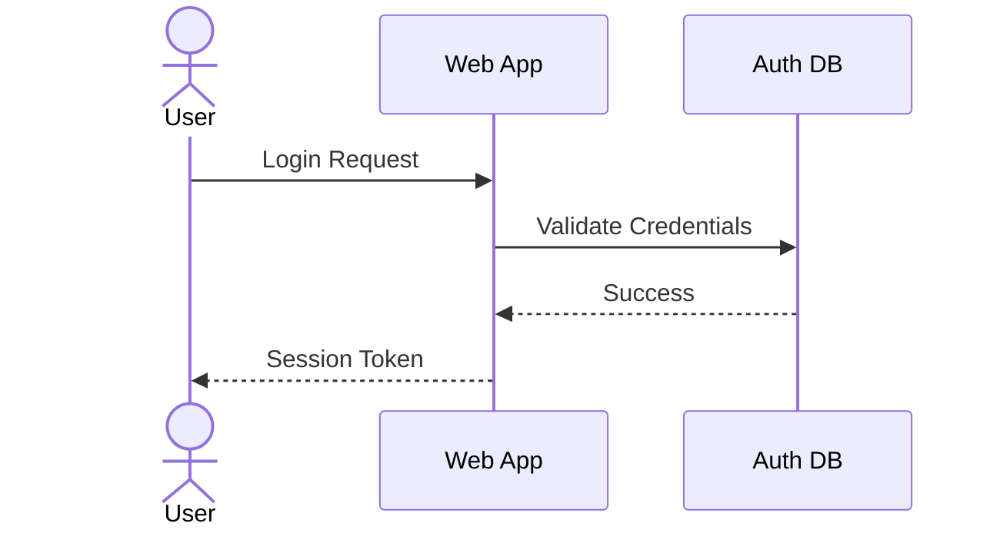

# Mermaid Test @SPEC-FLOAT-004

## Sequence Diagram



## Flowchart

```mmd:flow-example{caption="Build Flow"}
flowchart LR
    A[CommonSpec] --> B[SpecIR]
    B --> C[DOCX]
    B --> D[HTML]
```

See [mermaid:sequence-example](#) and [mmd:flow-example](#).
